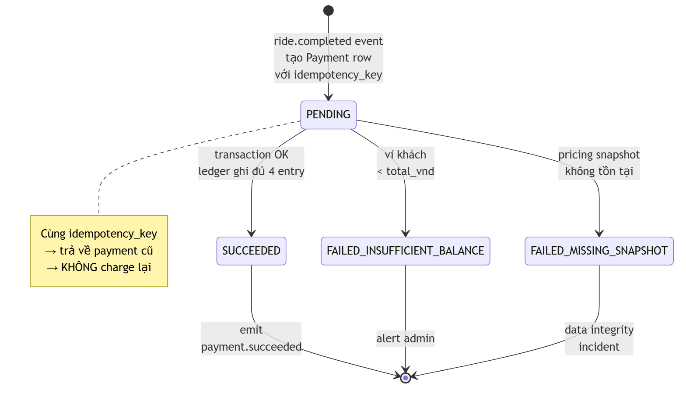
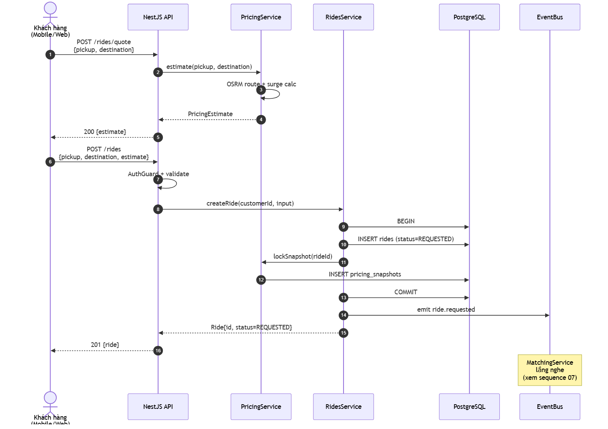
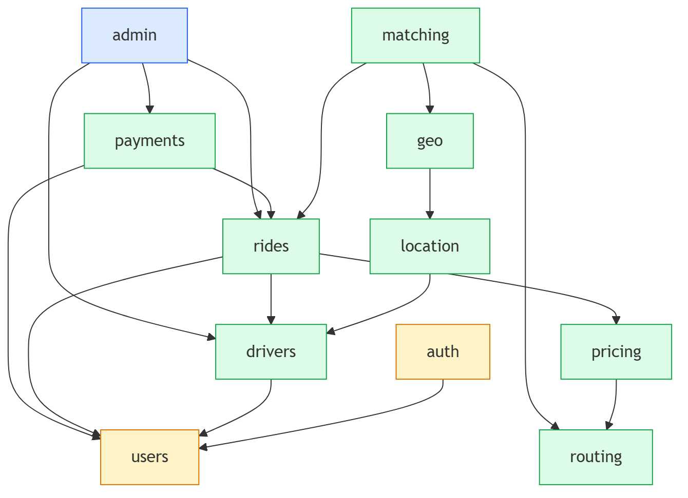

\newpage

# LỜI CAM ĐOAN

Tôi xin cam đoan đây là công trình nghiên cứu và thực hiện của riêng tôi dưới sự hướng dẫn của **[Học hàm, Học vị, Họ và tên Giảng viên hướng dẫn]**. Toàn bộ mã nguồn, thiết kế, văn bản trong khóa luận là sản phẩm cá nhân, các nguồn tài liệu tham khảo đều được trích dẫn đầy đủ và minh bạch. Nếu phát hiện sao chép không trích dẫn, tôi xin chịu hoàn toàn trách nhiệm theo quy định.

TP. Hồ Chí Minh, ngày … tháng … năm 2026

Sinh viên thực hiện

**Lý Hải Quân**

\newpage

# LỜI CẢM ƠN

Trước hết, em xin gửi lời cảm ơn chân thành và sâu sắc nhất đến **[Học hàm, Học vị, Họ và tên GVHD]** — người đã trực tiếp định hướng, góp ý chuyên môn và đồng hành cùng em trong suốt quá trình thực hiện khóa luận. Sự nghiêm khắc và những phản biện sắc bén của thầy/cô đã giúp em nhìn nhận lại nhiều quyết định thiết kế quan trọng, qua đó nâng cao chất lượng sản phẩm cuối cùng.

Em xin chân thành cảm ơn quý Thầy/Cô **Khoa [Tên Khoa]** — **Trường [Tên Trường]** đã truyền đạt kiến thức nền tảng và những kỹ năng tư duy hệ thống trong suốt bốn năm đại học, giúp em có đủ hành trang để thực hiện một đề tài hệ thống ở quy mô tương đối lớn.

Em xin cảm ơn gia đình, bạn bè đã luôn ủng hộ về tinh thần và vật chất trong giai đoạn em tập trung cho khóa luận. Cuối cùng, em gửi lời cảm ơn tới cộng đồng mã nguồn mở — đặc biệt là các maintainer của NestJS, TypeORM, Uber H3, Project OSRM, Mapbox và Expo — đã tạo ra những công cụ chất lượng mà đề tài này được kế thừa.

Mặc dù đã nỗ lực hết sức nhưng do thời gian và kinh nghiệm còn hạn chế, khóa luận khó tránh khỏi thiếu sót. Em rất mong nhận được ý kiến đóng góp từ quý Thầy/Cô và hội đồng để hoàn thiện đề tài.

Em xin chân thành cảm ơn!

\newpage

# TÓM TẮT KHÓA LUẬN

Khóa luận trình bày quá trình nghiên cứu, phân tích, thiết kế và hiện thực hóa **RideX** — một nền tảng đặt xe trực tuyến (ride-hailing) ở quy mô thu nhỏ mô phỏng các dịch vụ Grab/Uber. Hệ thống được xây dựng theo định hướng kiến trúc microservice với một monolith modular bằng **NestJS 10**, áp dụng triệt để **Domain-Driven Design** thông qua mẫu **Facade** giữa các bounded context, kết hợp **PostgreSQL 16** làm nguồn dữ liệu tin cậy duy nhất và **Redis 7** đảm nhận các tác vụ realtime, cache, hàng đợi.

Về phía nghiệp vụ, RideX cài đặt đầy đủ vòng đời một chuyến xe gồm: đăng ký/đăng nhập với **JWT + Argon2id**, ước tính giá với **surge** linh hoạt, **chiến lược matching** dựa trên chỉ mục không gian **Uber H3** kết hợp định tuyến **OSRM**, **gửi đề xuất tuần tự** qua WebSocket với **BullMQ** quản lý timeout, máy trạng thái nghiêm ngặt cho chuyến xe, **thanh toán idempotent** với sổ kế toán double-entry chia 80/20 giữa tài xế và nền tảng, và bảng điều khiển quản trị viên có kiểm toán truy cập.

Về phía client, đề tài hiện thực hóa **năm bề mặt người dùng** trong một monorepo pnpm + Turborepo: ba ứng dụng web cho khách hàng/tài xế/quản trị viên (Next.js 15, App Router, shadcn/ui) và hai ứng dụng mobile cho khách hàng/tài xế (Expo SDK 52, NativeWind 4, expo-router). Các package dùng chung (api-client, socket-client, shared-types, ui-tokens) giúp giữ logic và kiểu dữ liệu thống nhất xuyên suốt.

Kết quả đo đạc cho thấy hệ thống đạt **483 unit/integration test** xanh ở backend với coverage cao trên các đường nghiệp vụ quan trọng (matching, payment, ride state machine), TypeScript chặt chẽ cho toàn bộ 5 bề mặt client, và bộ **Maestro E2E** che phủ các race condition còn lại sau khi review. Đề tài đóng góp một blueprint kiến trúc tham khảo cho các hệ thống ride-hailing nhỏ và một mã nguồn mở chất lượng nghiên cứu cho cộng đồng học thuật trong nước.

**Từ khóa:** ride-hailing, NestJS, microservice, Domain-Driven Design, H3, OSRM, WebSocket, idempotency, double-entry ledger, Expo, Next.js.

\newpage

# ABSTRACT

This thesis presents the design and implementation of **RideX**, a miniature ride-hailing platform that emulates services such as Grab and Uber at a scope suitable for academic research. The system is architected as a **modular monolith** with strict bounded-context isolation enforced through the **Facade pattern**, built on **NestJS 10**, backed by **PostgreSQL 16** as the single source of truth and **Redis 7** for realtime indexing, caching, and queue management.

On the business side, RideX implements the full ride lifecycle: authentication via **JWT with Argon2id** password hashing, dynamic pricing with **surge multipliers**, a **matching engine** combining **Uber H3** spatial indexing with **OSRM** routing, **sequential WebSocket offers** with **BullMQ**-backed timeouts, a strict ride state machine, **idempotent payments** with a double-entry ledger and 80/20 platform split, and an audited admin dashboard.

On the client side, the project ships **five user surfaces** in a single pnpm + Turborepo monorepo: three web apps (Next.js 15, App Router, shadcn/ui) for customer, driver and admin, and two Expo apps (SDK 52, NativeWind 4) for customer and driver. Shared packages (api-client, socket-client, shared-types, ui-tokens) keep logic and types consistent across surfaces.

Measured outcomes: **483 passing backend tests** with high coverage on critical paths (matching, payments, ride state machine), strict TypeScript across all five surfaces, and a **Maestro E2E** harness covering driver-side regressions surfaced during code review. The project contributes a reference architecture blueprint for small-scale ride-hailing systems and a research-quality open codebase to the local academic community.

**Keywords:** ride-hailing, NestJS, microservice, Domain-Driven Design, H3, OSRM, WebSocket, idempotency, double-entry ledger, Expo, Next.js.

\newpage

# DANH MỤC HÌNH

| Hình | Tên | Trang |
|---|---|---|
| 1.1 | Quy mô thị trường gọi xe công nghệ Việt Nam 2020-2025 | … |
| 3.1 | Kiến trúc tổng thể RideX | … |
| 3.2 | Sơ đồ Use Case toàn hệ thống | … |
| 3.3 | Sơ đồ thực thể quan hệ (ERD) | … |
| 3.4 | Máy trạng thái Ride | … |
| 3.5 | Máy trạng thái Payment | … |
| 3.6 | Sequence — Khách đặt xe | … |
| 3.7 | Sequence — Matching engine | … |
| 3.8 | Sequence — In-ride realtime | … |
| 3.9 | Sequence — Auto-charge payment | … |
| 3.10 | Sơ đồ phụ thuộc giữa các module | … |
| 3.11 | Thuật toán H3 driver discovery | … |
| 4.1 | Sơ đồ deployment (docker-compose) | … |
| 4.2 | Demo màn hình khách hàng — đặt xe | … |
| 4.3 | Demo màn hình tài xế — nhận chuyến | … |
| 4.4 | Demo dashboard quản trị viên | … |

> *(Pandoc sẽ tự đánh số trang. Bảng này là khung; sau khi build .docx hãy thay bằng auto-generated TOC qua `\listoffigures`.)*

# DANH MỤC BẢNG

| Bảng | Tên | Trang |
|---|---|---|
| 2.1 | So sánh các thuật toán chỉ mục không gian | … |
| 3.1 | Đặc tả use case "Đặt xe" | … |
| 3.2 | Đặc tả use case "Matching" | … |
| 3.3 | Bảng chuyển trạng thái Ride hợp lệ | … |
| 4.1 | Phân bổ test coverage theo module | … |
| 4.2 | So sánh hiệu năng H3 vs PostGIS GIST | … |

# DANH MỤC VIẾT TẮT

| Viết tắt | Đầy đủ |
|---|---|
| API | Application Programming Interface |
| BPS | Basis Points (1 BPS = 0.01%) |
| BFF | Backend For Frontend |
| CQRS | Command Query Responsibility Segregation |
| DDD | Domain-Driven Design |
| DTO | Data Transfer Object |
| ERD | Entity-Relationship Diagram |
| ETA | Estimated Time of Arrival |
| H3 | Uber's Hexagonal Hierarchical Spatial Index |
| HTTP | HyperText Transfer Protocol |
| JWT | JSON Web Token |
| KYC | Know-Your-Customer |
| ORM | Object-Relational Mapping |
| OSM | OpenStreetMap |
| OSRM | Open Source Routing Machine |
| RBAC | Role-Based Access Control |
| REST | Representational State Transfer |
| TOCTOU | Time-Of-Check to Time-Of-Use |
| TTL | Time To Live |
| UI | User Interface |
| UX | User Experience |
| VND | Việt Nam Đồng |
| WS | WebSocket |

\newpage

# MỞ ĐẦU

## Lý do chọn đề tài

Trong những năm gần đây, lĩnh vực gọi xe công nghệ (ride-hailing) đã trở thành một trong những thị trường phát triển nhanh nhất tại Việt Nam. Theo báo cáo *e-Conomy SEA 2024* của Google, Temasek và Bain & Company, quy mô thị trường gọi xe và giao hàng Đông Nam Á đã vượt 30 tỷ USD vào năm 2024 và dự kiến đạt 60 tỷ USD vào năm 2030, trong đó Việt Nam chiếm tỷ trọng đáng kể với tốc độ tăng trưởng kép hai chữ số. Các nền tảng tiêu biểu như Grab, Be, Xanh SM hay Gojek đã trở thành một phần không thể thiếu của hạ tầng giao thông đô thị.

Tuy nhiên, đứng từ góc độ học thuật, **tài liệu mở** về kiến trúc bên trong các nền tảng này còn rất hạn chế. Các sinh viên ngành Công nghệ thông tin phần lớn chỉ được tiếp xúc với các đề tài "to-do list" hoặc "shop bán hàng" — vốn không đủ độ phức tạp để rèn luyện các kỹ năng thiết kế hệ thống ở quy mô doanh nghiệp như: đồng bộ realtime, máy trạng thái nghiêm ngặt, tính idempotency, sổ kế toán hai bút toán, chỉ mục không gian (spatial index), hay phân chia bounded context theo Domain-Driven Design.

Xuất phát từ khoảng trống đó, em chọn đề tài **"Nghiên cứu và xây dựng nền tảng đặt xe trực tuyến RideX dựa trên kiến trúc microservice với NestJS"** với mong muốn:

1. **Áp dụng** các pattern thiết kế hệ thống cấp doanh nghiệp vào một đề tài có nghiệp vụ phức tạp và gần với thực tế.
2. **Hệ thống hoá** kiến thức về Domain-Driven Design, máy trạng thái, idempotency, geospatial indexing, realtime communication trong một sản phẩm có thể đo lường và kiểm thử được.
3. **Đóng góp** một blueprint kiến trúc tham khảo cho cộng đồng học thuật Việt Nam, dưới dạng mã nguồn mở có chất lượng nghiên cứu.

## Mục tiêu của đề tài

### Mục tiêu tổng quát

Xây dựng được một nền tảng đặt xe hoàn chỉnh từ đầu đến cuối — gồm năm bề mặt người dùng (web/mobile cho khách hàng/tài xế và web cho quản trị viên) và một backend hợp nhất — đáp ứng đầy đủ chu trình nghiệp vụ một chuyến xe và đảm bảo các thuộc tính chất lượng phi chức năng quan trọng: bảo mật, khả năng mở rộng, tính nhất quán giao dịch, và khả năng quan sát hệ thống.

### Mục tiêu cụ thể

1. **Phân tích nghiệp vụ** đầy đủ vòng đời một chuyến xe: từ ước tính giá, đặt xe, tìm tài xế, gửi offer, chấp nhận, đến cập nhật trạng thái và thanh toán.
2. **Thiết kế kiến trúc** modular monolith với 11 bounded context riêng biệt, giao tiếp qua Facade và event bus.
3. **Hiện thực hoá** backend NestJS 10 hỗ trợ REST và WebSocket, với cơ chế xác thực JWT + Argon2id, RBAC, kiểm toán truy cập.
4. **Tích hợp** chỉ mục không gian Uber H3 và máy định tuyến OSRM để tìm tài xế gần và ước tính ETA.
5. **Xây dựng** matching engine gửi offer tuần tự với BullMQ timeout, đảm bảo không gửi trùng offer cho cùng tài xế trên cùng một ride.
6. **Cài đặt** pricing surge dựa trên tỷ lệ cung/cầu thời gian thực thông qua Redis ZSET.
7. **Bảo đảm idempotency** trong thanh toán bằng three-layer guard, sổ kế toán double-entry, và auto-trigger thông qua event-driven.
8. **Phát triển** năm bề mặt client trong cùng monorepo, đảm bảo tái sử dụng tối đa qua các package shared.
9. **Kiểm thử** đầy đủ các đường nghiệp vụ quan trọng với tỉ lệ test coverage cao và E2E Maestro cho các kịch bản race condition.

## Đối tượng và phạm vi nghiên cứu

### Đối tượng nghiên cứu

- Kiến trúc phần mềm cho hệ thống ride-hailing nhỏ và vừa.
- Các pattern thiết kế: Domain-Driven Design, Facade, Event-Driven Architecture, Idempotency, State Machine.
- Các công nghệ nền tảng: NestJS, TypeORM, Redis, Socket.IO, Next.js, Expo.
- Các thuật toán và thư viện đặc thù: Uber H3, OSRM, Argon2id, BullMQ.

### Phạm vi nghiên cứu

Phạm vi của khóa luận **giới hạn** trong các nội dung sau:

**Có trong phạm vi:**
- Xác thực, phân quyền RBAC.
- Toàn bộ luồng đặt xe — ghép cặp — đi xe — thanh toán bằng ví nội bộ.
- Realtime tracking vị trí tài xế và trạng thái chuyến xe.
- Bảng điều khiển quản trị viên (số liệu tổng quan, có audit log).
- Năm bề mặt client (web × 3, mobile × 2).
- Kiểm thử tự động (unit, integration, E2E).
- Triển khai cục bộ qua docker-compose.

**Ngoài phạm vi:**
- Tích hợp cổng thanh toán thật (VNPay, Momo, ZaloPay) — sử dụng ví nội bộ làm proxy.
- Tích hợp xác minh KYC tài xế (CMND, GPLX, đăng ký xe) — bỏ trống bằng nullable field.
- Tối ưu hóa machine learning cho matching (dynamic pricing, demand forecasting).
- Triển khai cloud production (chỉ kèm hướng dẫn tham khảo).
- Đa ngôn ngữ (chỉ tiếng Việt cho client, một số chuỗi trộn tiếng Anh).

## Phương pháp nghiên cứu

Đề tài kết hợp **bốn nhóm phương pháp**:

1. **Nghiên cứu tài liệu (literature review):** đọc các whitepaper, RFC và mã nguồn mở của các project tham chiếu (Uber H3, OSRM, NestJS), tổng hợp các pattern phổ biến trong các bài blog kỹ thuật của Uber Engineering, Lyft Engineering, Grab Tech.
2. **Phân tích và thiết kế hệ thống (system analysis & design):** chia bài toán thành các bounded context, vẽ sơ đồ use case, ERD, sequence diagram, state diagram trước khi viết code. Mỗi quyết định kiến trúc đều được ghi lại làm "Tech Decision" trong tài liệu thiết kế.
3. **Cài đặt từng bước (incremental implementation):** chia toàn bộ phạm vi thành **22 task nhỏ** (T001-T022) + **1 task E2E** (T024), mỗi task có spec riêng và được review chéo trước khi merge. Workflow này lấy cảm hứng từ trickle development của các đội kỹ thuật quy mô lớn.
4. **Kiểm thử và đo lường (testing & measurement):** mọi module được phủ unit test, các đường nghiệp vụ quan trọng được phủ integration test sử dụng SQLite in-memory hoặc Postgres ephemeral; các race condition còn lại được phủ E2E Maestro trên Android emulator.

## Bố cục khóa luận

Khóa luận được tổ chức thành **bốn chương chính** ngoài phần mở đầu và kết luận:

- **Chương 1 — Tổng quan đề tài:** trình bày bối cảnh thị trường gọi xe, các nền tảng hiện có, khoảng trống nghiên cứu và đóng góp của khóa luận.
- **Chương 2 — Cơ sở lý thuyết:** tổng hợp các kiến thức nền tảng được sử dụng — từ kiến trúc phần mềm (DDD, modular monolith), bảo mật (JWT, Argon2id), realtime (WebSocket), đến các thuật toán đặc thù (H3, định tuyến).
- **Chương 3 — Phân tích và thiết kế hệ thống:** đặc tả nghiệp vụ qua use case, mô hình dữ liệu qua ERD, máy trạng thái, các sequence diagram quan trọng và sơ đồ kiến trúc.
- **Chương 4 — Cài đặt và kết quả:** trình bày chi tiết các quyết định công nghệ, cài đặt nổi bật (matching engine, pricing surge, payment idempotency), kết quả kiểm thử và đo đạc.

Phần cuối cùng tổng kết kết quả đạt được, các hạn chế còn tồn tại và hướng phát triển trong tương lai.

\newpage

# Chương 1 — TỔNG QUAN ĐỀ TÀI

## 1.1. Bối cảnh thị trường gọi xe công nghệ

Sự xuất hiện của Uber vào năm 2009 đã định hình lại hoàn toàn ngành vận tải hành khách đô thị trên toàn cầu. Mô hình "gọi xe theo yêu cầu" (on-demand ride-hailing) tận dụng smartphone, GPS, và thuật toán ghép cặp để kết nối trực tiếp khách hàng với tài xế tự do mà không cần qua trung gian taxi truyền thống. Cấu trúc thị trường hai phía (two-sided marketplace) này tạo ra hiệu ứng mạng lưới: càng nhiều khách hàng thì càng thu hút tài xế, càng nhiều tài xế thì thời gian chờ càng giảm và càng hút khách.

Tại Việt Nam, thị trường này được khai phá bởi Grab và Uber từ năm 2014. Sau khi Uber rút lui khu vực Đông Nam Á vào năm 2018, thị trường nội địa chứng kiến sự xuất hiện của các tay chơi mới như Be (2018), Gojek (2018), và gần đây nhất là Xanh SM (2023) — nền tảng gọi xe điện do Vingroup vận hành. Theo thống kê của *Q&Me* (2024), khoảng 76% người dùng smartphone tại các đô thị lớn (Hà Nội, TP. HCM, Đà Nẵng) sử dụng ít nhất một ứng dụng gọi xe thường xuyên, trong đó Grab chiếm khoảng 41% thị phần, Xanh SM 24%, Be 19%, Gojek 12%, còn lại là taxi truyền thống có ứng dụng riêng.

Quy mô và độ phức tạp của các nền tảng này ngày càng tăng. Một nền tảng ride-hailing hiện đại phải xử lý đồng thời:

- Hàng triệu request mỗi giờ ở các đô thị lớn.
- Cập nhật vị trí GPS của hàng trăm nghìn tài xế trực tuyến với tần suất 3-5 giây.
- Ghép cặp khách-tài xế với độ trễ dưới 5 giây.
- Tính toán giá động (surge pricing) dựa trên cung-cầu thời gian thực.
- Đảm bảo giao dịch tài chính chính xác và không trùng lặp.
- Phục vụ qua nhiều bề mặt: web khách hàng, web đối tác tài xế, ứng dụng mobile cho cả hai phía, dashboard quản trị nội bộ.

Mỗi yêu cầu trên đều ẩn chứa các thách thức kỹ thuật phi tầm thường, đòi hỏi kiến thức tổng hợp từ nhiều lĩnh vực.

## 1.2. Khảo sát các nền tảng hiện có

### 1.2.1. Grab

Grab khởi đầu là MyTeksi (Malaysia, 2012), mở rộng sang Việt Nam năm 2014. Hệ kiến trúc Grab hiện được công bố qua các bài blog của Grab Tech Engineering cho thấy đặc trưng:

- **Microservice quy mô lớn**: hàng nghìn service Go/Java/Python.
- **Spatial index nội bộ** (lấy cảm hứng từ Uber H3 nhưng có biến thể riêng).
- **Cassandra + Kafka** cho dữ liệu sự kiện tài xế.
- **Event sourcing** cho payment và wallet.

Điểm mạnh: khả năng mở rộng cực lớn, đa quốc gia. Điểm yếu (đối với học thuật): tài liệu nội bộ không công khai.

### 1.2.2. Uber

Uber là người tiên phong và cũng là người đóng góp nhiều nhất cho cộng đồng mã nguồn mở trong lĩnh vực này — **H3** (chỉ mục không gian hexagonal), **AresDB** (real-time analytics database), **Cadence** (workflow engine), và rất nhiều bài blog kỹ thuật chi tiết. Kiến trúc tham chiếu của Uber bao gồm:

- **Dispatcher** (đảm nhận matching).
- **Spatial Index** (H3).
- **Pricing Service** (surge dựa trên ML).
- **Trip Service** (vòng đời ride).
- **Money Service** (ledger và payout).

Đề tài này lấy nhiều cảm hứng kiến trúc từ Uber, đặc biệt là **H3**, máy trạng thái ride, và mô hình ledger.

### 1.2.3. Be và Xanh SM

Be là nền tảng nội địa Việt Nam, công bố đã đạt 30 triệu tải xuống tính đến 2024. Xanh SM là tân binh nhưng có ưu thế do thuộc hệ sinh thái VinFast với đội xe điện sở hữu. Cả hai đều không công khai kiến trúc, nhưng dựa trên tính năng và độ ổn định có thể suy đoán đều dùng kiến trúc microservice tương tự Grab.

### 1.2.4. So sánh tổng quan

| Tiêu chí | Grab | Uber | Be | Xanh SM | **RideX (đề tài)** |
|---|---|---|---|---|---|
| Quy mô | Khu vực ĐNÁ | Toàn cầu | Việt Nam | Việt Nam | Học thuật |
| Số lượng service | ~1000+ | ~3000+ | n/a | n/a | 11 module (monolith) |
| Tài liệu mở | Một phần | Nhiều | Không | Không | **Đầy đủ** |
| Mã nguồn mở | Một phần | H3, Cadence | Không | Không | **Toàn bộ** |
| Spatial index | Nội bộ | H3 | n/a | n/a | H3 |
| Định tuyến | Nội bộ | Nội bộ | n/a | n/a | OSRM |
| Cổng thanh toán | Tích hợp | Tích hợp | Tích hợp | Tích hợp | Ví nội bộ |

## 1.3. Khoảng trống nghiên cứu và đóng góp của khóa luận

Khảo sát ở Mục 1.2 cho thấy: mặc dù thị trường ride-hailing tại Việt Nam đã trưởng thành, **tài liệu mở** về kiến trúc bên trong còn rất khiêm tốn. Cộng đồng học thuật nội địa gặp khó khăn khi muốn tiếp cận đề tài này vì:

1. **Không có hệ thống mẫu** đủ độ phức tạp nhưng vẫn ở quy mô có thể hiểu được trong một khóa luận.
2. **Tài liệu kỹ thuật bằng tiếng Việt** hầu như không có, sinh viên phải tự đọc tài liệu tiếng Anh và bài blog quốc tế.
3. **Các pattern thiết kế** (như idempotency, event sourcing, state machine) thường được dạy lý thuyết nhưng thiếu ví dụ áp dụng vào nghiệp vụ thực tế.

**Đóng góp** của khóa luận này:

- **Đóng góp 1 — Blueprint kiến trúc**: cung cấp một thiết kế tham chiếu (reference architecture) hoàn chỉnh cho hệ thống ride-hailing nhỏ, phù hợp đào tạo và nghiên cứu trong nước.
- **Đóng góp 2 — Mã nguồn chất lượng**: toàn bộ codebase được kiểm tra qua quy trình review chặt chẽ, có test coverage cao, tuân thủ các nguyên tắc Clean Architecture và Domain-Driven Design.
- **Đóng góp 3 — Tài liệu kỹ thuật bằng tiếng Việt**: thuyết minh chi tiết các quyết định công nghệ, đặc biệt là những phần khó như matching engine, idempotency và H3 indexing.
- **Đóng góp 4 — Mẫu workflow phát triển**: minh hoạ cách chia một feature lớn thành các task nhỏ có spec rõ ràng và quy trình review — một kỹ năng mà sinh viên ngành phần mềm cần được rèn luyện sớm.

\newpage

# Chương 2 — CƠ SỞ LÝ THUYẾT

## 2.1. Kiến trúc phần mềm

### 2.1.1. Modular Monolith và Microservice

Hai phương án tổ chức mã nguồn phổ biến nhất cho hệ thống doanh nghiệp là **monolith** và **microservice**. Một **monolith** tập hợp toàn bộ logic nghiệp vụ trong một mã nguồn và triển khai duy nhất; một **microservice** phân tách thành nhiều dịch vụ độc lập, giao tiếp qua mạng.

Microservice mang lại khả năng mở rộng độc lập từng dịch vụ, khả năng dùng nhiều ngôn ngữ, và biên giới rõ ràng giữa các đội phát triển. Đổi lại, microservice trả giá bằng độ phức tạp triển khai cao, các vấn đề về truy tìm phân tán (distributed tracing), giao dịch phân tán (distributed transaction), và quản lý service mesh.

Trong nhiều năm gần đây, cộng đồng đã đưa ra một phương án trung gian: **modular monolith**. Mã nguồn vẫn là một deployment duy nhất, nhưng được tổ chức thành nhiều **module** với biên giới rõ ràng — mỗi module có thể độc lập về dữ liệu, dịch vụ, và giao tiếp với module khác chỉ thông qua **API công khai** (thường là Facade). Khi quy mô đủ lớn, một module có thể tách ra thành microservice mà không cần viết lại logic. Đây chính là phương án được áp dụng trong RideX.

Lựa chọn modular monolith cho khóa luận xuất phát từ ba lý do:

1. **Phù hợp quy mô đề tài**: một sinh viên không thể vận hành hàng chục microservice trên hạ tầng cục bộ.
2. **Giữ được kỷ luật thiết kế** giống microservice (boundary, dependency direction, facade).
3. **Dễ trình bày**: hội đồng có thể chạy toàn bộ hệ thống bằng một câu lệnh duy nhất `docker-compose up`.

### 2.1.2. Domain-Driven Design

**Domain-Driven Design (DDD)** do Eric Evans giới thiệu trong cuốn sách cùng tên (2003) là một phương pháp luận thiết kế phần mềm, tập trung vào việc mô hình hoá nghiệp vụ chính xác bằng **ngôn ngữ chung** (ubiquitous language) giữa lập trình viên và chuyên gia nghiệp vụ. Hai khái niệm cốt lõi của DDD được dùng trong RideX:

- **Bounded Context**: là một ranh giới logic trong đó một mô hình nghiệp vụ có ý nghĩa thống nhất. Trong RideX, các bounded context là: `auth`, `users`, `drivers`, `location`, `geo`, `routing`, `matching`, `pricing`, `rides`, `payments`, `admin`. Mỗi bounded context có module, entity, service, và facade riêng.
- **Aggregate**: là cụm các entity có vòng đời gắn kết, thay đổi qua một entity gốc (root). Ví dụ trong RideX: `Ride` là aggregate root, các `RideOffer` thuộc về nó nhưng chỉ được thao tác qua RidesService.

### 2.1.3. Mẫu Facade

Pattern **Facade** cung cấp một giao diện đơn giản hoá che bên trong một hệ thống phức tạp. Trong RideX, mỗi module xuất ra một class `*.facade.ts` (ví dụ: `RidesFacade`, `PricingFacade`) — các module khác **bắt buộc** truy cập qua facade này, **không được** import trực tiếp service hay repository.

Quy ước này có ba lợi ích:

1. **Giảm khớp nối (coupling)**: nếu logic nội bộ của một module thay đổi, các module khác không bị ảnh hưởng.
2. **Dễ kiểm thử**: facade có thể được mock dễ dàng.
3. **Sẵn sàng tách microservice**: khi cần tách, ta chỉ việc thay implementation của facade từ "call method" sang "HTTP call".

### 2.1.4. Kiến trúc hướng sự kiện (Event-Driven Architecture)

Bên cạnh gọi đồng bộ qua facade, các module trong RideX còn giao tiếp gián tiếp qua **event bus** (NestJS `@nestjs/event-emitter`). Mỗi event là một thông báo về một sự kiện nghiệp vụ đã xảy ra: `ride.requested`, `ride.matched`, `ride.completed`, `payment.succeeded`, `driver.went-online`, `driver.location-updated`.

Lợi ích chính của event-driven:

- **Loose coupling**: module phát sự kiện không cần biết module nào sẽ phản ứng.
- **Mở rộng dễ**: thêm một consumer mới chỉ cần lắng nghe event đã có.
- **Hỗ trợ async**: các xử lý nặng (như matching, payment) có thể xảy ra ngoài request-response.

Trong RideX, các sự kiện hiện được phát đồng bộ trong process. Khi tách microservice trong tương lai, có thể chuyển sang Kafka hoặc Redis Streams mà không thay đổi domain logic.

## 2.2. Công nghệ nền tảng

### 2.2.1. NestJS

**NestJS** là một framework Node.js cho backend, sử dụng TypeScript, được lấy cảm hứng từ Angular về kiến trúc dependency injection. Các thành phần chính của NestJS được dùng trong RideX:

- **Module**: đơn vị tổ chức, mỗi bounded context là một module.
- **Controller**: nhận request HTTP, parse DTO, gọi service.
- **Service**: chứa logic nghiệp vụ.
- **Facade**: lớp công khai cho module khác (quy ước riêng của RideX).
- **Gateway**: xử lý WebSocket.
- **Guard**: kiểm tra xác thực và phân quyền.
- **Interceptor**: middleware logic-level.
- **Pipe**: validate và transform DTO.

NestJS được chọn vì kết hợp được hai ưu điểm: hệ sinh thái Node.js phong phú và kỷ luật của TypeScript + dependency injection — phù hợp cho một đề tài muốn rèn luyện thiết kế hệ thống.

### 2.2.2. TypeORM

**TypeORM** là một ORM cho TypeScript hỗ trợ nhiều database (PostgreSQL, MySQL, SQLite, …). RideX sử dụng TypeORM kết hợp với PostgreSQL. Đặc trưng:

- **Entity**: định nghĩa schema bảng qua decorator.
- **Repository**: API truy vấn type-safe.
- **Migration**: phiên bản hoá schema, **bắt buộc** trong RideX cho mọi thay đổi cấu trúc.
- **Transaction**: bao bọc nhiều thao tác trong một giao dịch ACID.

Lý do chọn TypeORM thay vì Prisma: TypeORM có hỗ trợ tốt hơn cho các tính năng nâng cao của PostgreSQL như `enumName`, `partial unique index`, raw SQL và `FOR UPDATE` lock — những thứ RideX cần cho matching và payment.

### 2.2.3. Redis

**Redis** là một in-memory data store hỗ trợ nhiều cấu trúc dữ liệu (string, hash, set, sorted set, stream). Trong RideX, Redis đảm nhận bốn nhiệm vụ:

1. **Chỉ mục H3**: mỗi H3 cell là một SET chứa danh sách ID tài xế đang online trong cell đó.
2. **Cache vị trí**: hash `driver:location:{id}` chứa tọa độ mới nhất với TTL.
3. **Demand ZSET**: sorted set `pricing:demand:{cellId}` chứa các request đang chờ với timestamp làm score, dùng cho surge pricing.
4. **Queue BullMQ**: hàng đợi cho offer timeout.

### 2.2.4. PostgreSQL

PostgreSQL được chọn làm cơ sở dữ liệu chính vì:

- Hỗ trợ kiểu **enum** native, dùng cho ride status, payment status, role.
- Hỗ trợ **partial unique index** cho ràng buộc đặc biệt (ví dụ: chỉ một offer ACCEPTED cho mỗi ride).
- Hỗ trợ **FOR UPDATE** locking, cần thiết cho payment idempotency.
- Hỗ trợ **JSONB** cho audit log metadata.
- Hệ sinh thái và tài liệu mạnh.

### 2.2.5. Socket.IO

**Socket.IO** là một thư viện realtime communication trên nền WebSocket với fallback HTTP long-polling. RideX dùng Socket.IO cho:

- Cập nhật vị trí tài xế (driver → server → khách hàng).
- Đẩy offer đến tài xế (server → driver).
- Đồng bộ trạng thái chuyến xe (server → cả hai phía).

Socket.IO được chọn thay vì WebSocket thuần vì:

- Hỗ trợ **room**: dễ broadcast theo nhóm (ví dụ: tất cả người trong phòng `ride:{rideId}`).
- Hỗ trợ **ack callback**: đảm bảo phía gửi biết phía nhận đã xử lý.
- **Reconnection** tự động: client mobile mất sóng ngắn không bị disconnect cứng.

## 2.3. Bảo mật

### 2.3.1. JWT — JSON Web Token

**JWT** (RFC 7519) là chuẩn tạo token có thể xác minh bằng chữ ký, dùng làm credential xác thực cho REST API. Một JWT gồm ba phần: header, payload, signature, mã hoá Base64URL và nối bằng dấu chấm.

RideX sử dụng cặp **access token + refresh token**:

- **Access token**: TTL ngắn (15 phút mặc định), gửi qua header `Authorization: Bearer …`, không lưu ở server.
- **Refresh token**: TTL dài (7 ngày), được hash bằng SHA-256 và lưu vào bảng `refresh_tokens`, dùng để cấp lại access token. Mỗi lần refresh sẽ rotate — token cũ bị thu hồi, cấp token mới.

Cơ chế rotate này phòng chống tấn công replay: nếu kẻ tấn công lấy được một refresh token bằng cách nào đó, lần dùng kế tiếp của họ sẽ vô hiệu hoá ngay vì server đã rotate.

### 2.3.2. Argon2id — Hash mật khẩu

Mật khẩu người dùng được hash bằng **Argon2id** — thuật toán đoạt giải Password Hashing Competition 2015 do Internet Research Task Force tổ chức. Argon2 có ba biến thể: Argon2d (chống GPU), Argon2i (chống side-channel), Argon2id (kết hợp cả hai), trong đó Argon2id được khuyến nghị cho mật khẩu.

Tham số được dùng trong RideX:

- `memoryCost = 19,456` KB (~19 MB).
- `timeCost = 2` (số lần lặp).
- `parallelism = 1`.

Các tham số này tuân theo khuyến nghị của **OWASP Password Storage Cheat Sheet (2024)**. Ưu thế của Argon2id so với bcrypt: kháng GPU/ASIC tốt hơn nhờ yêu cầu lượng RAM lớn.

### 2.3.3. RBAC — Role-Based Access Control

RideX định nghĩa **ba role**: `CUSTOMER`, `DRIVER`, `ADMIN`. Mỗi endpoint REST hoặc event WebSocket được gắn decorator `@Roles(Role.X)` và `RolesGuard` sẽ kiểm tra ở runtime.

Bên cạnh role, RideX còn thực thi **object-level authorization**: ngay cả khi một CUSTOMER có quyền truy cập endpoint `/rides/:id`, request vẫn bị từ chối nếu `:id` không thuộc về user đó. Đây là biện pháp phòng chống **Insecure Direct Object Reference (IDOR)** — một lỗ hổng OWASP Top 10.

### 2.3.4. WebSocket Security

Khác với REST, WebSocket connect một lần rồi gửi nhiều message — nên xác thực **phải xảy ra ở thời điểm connect**. RideX cài đặt `WsAuthGuard` đọc JWT từ handshake auth payload, từ chối connect nếu invalid. Mỗi event sau đó được kiểm tra `room permission`: ví dụ, customer chỉ subscribe được room `ride:{rideId}` nếu họ là customer của ride đó.

## 2.4. Geospatial — Uber H3

Một bài toán cốt lõi của ride-hailing là **tìm tài xế gần điểm đón**. Cách ngây thơ là quét toàn bộ bảng tài xế và tính khoảng cách — không khả thi khi có hàng chục nghìn tài xế. Giải pháp là dùng **chỉ mục không gian** (spatial index).

Có ba họ chỉ mục phổ biến:

- **GIST / R-Tree** (PostGIS): chia mặt phẳng thành hình chữ nhật bao quanh các điểm.
- **Geohash**: chia thế giới thành ô vuông theo lưới latitude/longitude.
- **H3** (Uber): chia thế giới thành lưới **hexagon** ở nhiều độ phân giải.

**Lý do RideX chọn H3** (so sánh chi tiết ở Mục 4.3.1):

- **Hexagon có khoảng cách trung tâm đồng đều** đến mọi cell lân cận — bất lợi của hình chữ nhật trong geohash là khoảng cách đến cell chéo lớn hơn cell cạnh.
- **Hierarchical**: dễ chuyển đổi giữa các độ phân giải (zoom level).
- **Mã nguồn mở MIT**, có thư viện chính thức cho Node.js (`h3-js`).

H3 cung cấp hai hàm cốt lõi được dùng trong RideX:

- `latLngToCell(lat, lng, resolution)`: trả về ID của hexagon chứa điểm.
- `gridDisk(cellId, k)`: trả về tất cả hexagon trong bán kính `k` cell (ring 0 = chính nó, ring 1 = 6 cell sát, ring 2 = 12 cell vòng ngoài, …).

Resolution 9 (~150m mỗi cell) được chọn cho RideX vì cân bằng giữa độ chính xác và số lượng cell cần quét.

## 2.5. Định tuyến — OSRM

Sau khi tìm được các tài xế gần, ta cần ước tính **thời gian đến nơi (ETA)** và **quãng đường thực** (theo đường, không phải đường chim bay) — đây là bài toán **shortest path** trên graph đường giao thông.

**OSRM** (Open Source Routing Machine) là một máy định tuyến mã nguồn mở viết bằng C++, sử dụng dữ liệu OpenStreetMap. OSRM tiền xử lý graph thành cấu trúc cho phép truy vấn dưới 5 mili-giây. RideX gọi OSRM qua HTTP API:

```
GET /route/v1/driving/{src_lng},{src_lat};{dst_lng},{dst_lat}
```

Phản hồi gồm: distance (mét), duration (giây), geometry (encoded polyline). Geometry được trả về client để vẽ tuyến đường trên bản đồ.

Khi OSRM không sẵn sàng (lỗi mạng, container crash), RideX có cơ chế **fallback haversine**: tính khoảng cách chim bay × hệ số đường (`ROUTING_FALLBACK_ROAD_FACTOR=1.3`), chia cho tốc độ trung bình thành phố (`ROUTING_FALLBACK_CITY_SPEED_KMH=30`). Confidence của estimate được đánh dấu `"low"` để client có thể hiển thị warning.

## 2.6. Idempotency và Double-Entry Ledger

### 2.6.1. Idempotency

**Idempotency** là tính chất của một thao tác: gọi nhiều lần với cùng đầu vào cho cùng đầu ra, không gây thay đổi phụ. Trong thanh toán, idempotency là **bắt buộc**: nếu khách hàng nhấn nút "Thanh toán" hai lần, hoặc network retry, hệ thống không được trừ tiền hai lần.

RideX cài đặt idempotency qua **three-layer guard**:

- **Lớp 1 — Idempotency key ở app layer**: mỗi thao tác thanh toán được gắn key `ride:{rideId}`. Trước khi xử lý, service kiểm tra `payments.idempotency_key` có tồn tại chưa.
- **Lớp 2 — Unique constraint ở DB**: cột `payments.idempotency_key` có `UNIQUE` index — nếu app layer race, INSERT thứ hai sẽ fail với `23505`.
- **Lớp 3 — Transaction + FOR UPDATE**: bao toàn bộ logic trừ ví trong một transaction với `SELECT ... FOR UPDATE` trên ví để chống race ở mức row.

### 2.6.2. Double-Entry Ledger

**Double-entry bookkeeping** là nguyên tắc kế toán có từ thế kỷ XV: mỗi giao dịch tài chính phải được ghi vào ít nhất hai tài khoản, một bên DEBIT và bên còn lại CREDIT, sao cho tổng DEBIT = tổng CREDIT. Nguyên tắc này đảm bảo:

- **Audit trail**: mọi sự thay đổi số dư đều có nguồn gốc rõ ràng.
- **Phát hiện lỗi**: nếu tổng DEBIT ≠ CREDIT, lỗi xảy ra ngay lập tức.
- **Reconcile**: số dư ví bất kỳ thời điểm = sum(CREDIT) - sum(DEBIT) từ ledger.

Trong RideX, mỗi payment thành công sinh ra bốn ledger entry:

| Tài khoản | Direction | Số tiền |
|---|---|---|
| customer.wallet | DEBIT | total_vnd |
| driver.wallet | CREDIT | driver_share_vnd (80%) |
| platform.wallet | CREDIT | platform_share_vnd (20%) |

Tổng DEBIT = tổng CREDIT = `total_vnd`. (Lưu ý: kỹ thuật chia 80/20 sử dụng cột `driver_share_vnd` và `platform_share_vnd` tách rời để không có sai số làm tròn.)

## 2.7. Frontend hiện đại

### 2.7.1. Next.js 15 và App Router

**Next.js** là framework React full-stack do Vercel phát triển. Phiên bản 15 (2024) hoàn thiện **App Router** — mô hình routing mới dựa trên file system, hỗ trợ React Server Components (RSC). Trong RideX:

- Mỗi đường dẫn URL là một thư mục dưới `app/`, file `page.tsx` định nghĩa nội dung.
- Layout chung được khai báo trong `layout.tsx`, áp dụng cascading cho mọi route con.
- Server Component (mặc định) render ở server, không kèm JavaScript xuống client — tốt cho SEO và performance.
- Client Component (đánh dấu `"use client"`) cho phần cần interactivity.

### 2.7.2. TanStack Query

**TanStack Query** (trước đây React Query) là thư viện quản lý server state cho React. Trong RideX, mọi truy cập backend đều đi qua TanStack Query để:

- **Cache** kết quả: tránh request thừa.
- **Auto refetch**: dữ liệu cũ được làm mới khi cửa sổ active trở lại.
- **Mutation**: thực hiện POST/PUT/DELETE với optimistic update.
- **Infinite query**: phân trang vô tận cho lịch sử thanh toán.

### 2.7.3. shadcn/ui và NativeWind

**shadcn/ui** không phải thư viện component — mà là một bộ "công thức" để **copy** mã nguồn component vào project, dùng Radix UI làm primitive và Tailwind CSS để style. Cách tiếp cận này cho phép tuỳ biến hoàn toàn mà không bị khoá bởi API thư viện.

**NativeWind** mang cú pháp Tailwind sang React Native — viết style bằng class string trong `className` trên cả mobile và web, giữ design system thống nhất.

### 2.7.4. Expo và expo-router

**Expo** là framework cho React Native, đơn giản hoá quy trình build và deploy. Phiên bản SDK 52 (2024) hỗ trợ React Native 0.76 và New Architecture (Fabric + TurboModules) tuỳ chọn.

**expo-router** mang mô hình file-based routing của Next.js sang mobile — cùng cấu trúc thư mục `app/` để khai báo route, giúp developer chuyển đổi giữa web và mobile mượt mà.

## 2.8. Tổng kết chương

Chương 2 đã trình bày các nền tảng lý thuyết và công nghệ được sử dụng trong RideX: từ kiến trúc phần mềm (modular monolith, DDD, facade, event-driven), bảo mật (JWT, Argon2id, RBAC), geospatial (H3), định tuyến (OSRM), đến nguyên tắc idempotency và double-entry ledger trong tài chính. Mỗi quyết định công nghệ đều có lý do cụ thể, được chọn để phục vụ một yêu cầu cụ thể của bài toán ride-hailing. Chương 3 tiếp theo sẽ trình bày cách các nền tảng này được tổng hợp thành thiết kế hệ thống cụ thể của RideX.

\newpage

# Chương 3 — PHÂN TÍCH VÀ THIẾT KẾ HỆ THỐNG

## 3.1. Kiến trúc tổng thể

RideX được tổ chức theo mô hình **modular monolith ba tầng**:

{width=90%}

- **Tầng Client (5 surface)**: web-customer (Next.js, :3001), web-driver (:3002), web-admin (:3003), mobile-customer (Expo, :8081), mobile-driver (Expo, :8082).
- **Tầng API Gateway**: NestJS monolith, expose REST tại `/api/v1` và Socket.IO tại `/socket.io`.
- **Tầng Module nghiệp vụ (11 bounded context)**: auth, users, drivers, location, geo, routing, matching, pricing, rides, payments, admin.
- **Tầng Dữ liệu**: PostgreSQL 16 (source of truth) và Redis 7 (H3 index, cache, queue).
- **Dịch vụ ngoài**: OSRM (định tuyến) và Mapbox (tile + geocoding).

## 3.2. Phân tích nghiệp vụ — Use Case

### 3.2.1. Sơ đồ use case tổng thể

{width=90%}

Hệ thống có **bốn actor**:

- **Khách hàng (Customer)**: người đặt xe, theo dõi, thanh toán.
- **Tài xế (Driver)**: người nhận chuyến, thực hiện chuyến đi.
- **Quản trị viên (Admin)**: người quản lý hệ thống.
- **Hệ thống tự động (System)**: các tác vụ chạy nền (matching, pricing, auto-charge) không do con người trực tiếp gây ra mà do event-driven.

### 3.2.2. Đặc tả use case "Đặt xe"

**Bảng 3.1 — Đặc tả use case "Đặt xe"**

| Mục | Nội dung |
|---|---|
| **Tên** | Đặt xe |
| **Actor chính** | Khách hàng |
| **Mô tả** | Khách hàng nhập điểm đón, điểm đến, xem ước tính giá, xác nhận đặt xe |
| **Tiền điều kiện** | Khách hàng đã đăng nhập với role CUSTOMER |
| **Hậu điều kiện** | Một bản ghi `rides` với status `REQUESTED` được tạo, kèm `pricing_snapshot` |
| **Luồng chính** | 1. Khách chọn điểm đón trên bản đồ (mặc định là vị trí hiện tại). 2. Khách chọn điểm đến. 3. Hệ thống gọi `POST /rides/quote` để hiển thị giá ước tính. 4. Khách nhấn "Xác nhận đặt xe". 5. Hệ thống gọi `POST /rides` tạo ride và snapshot giá. 6. Hệ thống emit event `ride.requested`, MatchingService nhận và bắt đầu tìm tài xế. 7. Hệ thống chuyển khách sang màn hình "Đang tìm tài xế". |
| **Luồng phụ — Không có tài xế** | Sau khi MatchingService thử hết candidate, ride chuyển sang `FAILED`. Khách nhận thông báo và có thể đặt lại. |
| **Luồng phụ — Khách hủy** | Khách có thể nhấn "Hủy" trước khi tài xế chấp nhận. Hệ thống chuyển ride sang `CANCELLED`. |

### 3.2.3. Đặc tả use case "Matching"

**Bảng 3.2 — Đặc tả use case "Matching"**

| Mục | Nội dung |
|---|---|
| **Tên** | Ghép cặp tài xế |
| **Actor chính** | Hệ thống tự động (System) |
| **Mô tả** | Sau khi có ride mới, hệ thống tìm tài xế gần và gửi offer tuần tự |
| **Tiền điều kiện** | Có ride status `REQUESTED` |
| **Hậu điều kiện** | Hoặc ride chuyển sang `MATCHED`, hoặc `FAILED` |
| **Luồng chính** | 1. Lắng nghe `ride.requested`. 2. Gọi `GeoFacade.discoverDrivers` lấy candidate. 3. Tính ETA và distance qua `RoutingFacade.estimate` cho mỗi candidate. 4. Tính score cho mỗi candidate và rank. 5. Gửi offer cho candidate đầu, đợi tối đa 15 giây. 6. Nếu accept: cập nhật ride `MATCHED`. 7. Nếu reject/timeout: tiếp candidate sau. 8. Hết candidate: ride `FAILED`. |
| **Quy tắc** | - Không gửi offer trùng cho cùng cặp (driver, ride). - Mỗi offer có timeout độc lập qua BullMQ. - Driver chỉ nhận được tối đa 1 offer cùng lúc. |

## 3.3. Thiết kế dữ liệu — ERD

### 3.3.1. Sơ đồ thực thể quan hệ

{width=95%}

Cơ sở dữ liệu PostgreSQL có **10 bảng chính**:

- `users`: tài khoản, role.
- `drivers`: hồ sơ tài xế (1-1 với user role DRIVER).
- `refresh_tokens`: token làm mới.
- `rides`: chuyến xe.
- `ride_offers`: offer cho từng candidate.
- `pricing_snapshots`: snapshot giá khoá tại thời điểm đặt.
- `wallets`: ví của khách hàng, tài xế, nền tảng.
- `payments`: giao dịch thanh toán.
- `ledger_entries`: bút toán double-entry.
- `audit_logs`: log admin action.

### 3.3.2. Các ràng buộc đặc biệt

**Bảng `ride_offers` có hai partial unique index:**

```sql
-- Mỗi driver-ride chỉ có một offer ACCEPTED
CREATE UNIQUE INDEX one_accepted_per_pair
ON ride_offers (driver_user_id, ride_id)
WHERE status = 'ACCEPTED';

-- Mỗi ride chỉ có một offer ACCEPTED tổng cộng
CREATE UNIQUE INDEX one_accepted_per_ride
ON ride_offers (ride_id)
WHERE status = 'ACCEPTED';
```

Hai index này biến luồng matching thành **race-safe ở mức database**: ngay cả khi hai driver cùng nhấn Accept đồng thời, chỉ một bản UPDATE thành công, bản kia fail với `23505`.

**Bảng `payments`** có `UNIQUE` trên `idempotency_key` đảm bảo không có hai bản ghi cùng key.

**Bảng `wallets`** dùng `bigint` (VND không có phần thập phân), không dùng `decimal` vì PostgreSQL `bigint` đủ lớn (~9.2 tỷ tỷ).

## 3.4. Máy trạng thái

### 3.4.1. Máy trạng thái Ride

{width=85%}

Một chuyến xe có **bảy trạng thái**: `REQUESTED`, `MATCHED`, `ARRIVED`, `IN_RIDE`, `COMPLETED`, `CANCELLED`, `FAILED`. Các chuyển dịch hợp lệ được liệt kê trong bảng dưới:

**Bảng 3.3 — Bảng chuyển trạng thái Ride hợp lệ**

| Từ | Đến | Actor | Điều kiện |
|---|---|---|---|
| REQUESTED | MATCHED | System (matching) | Driver chấp nhận offer |
| REQUESTED | CANCELLED | Customer | Trước khi matching xong |
| REQUESTED | FAILED | System | Hết candidate |
| MATCHED | ARRIVED | Driver | Tới điểm đón |
| MATCHED | CANCELLED | Customer / Driver | Tự nguyện huỷ |
| MATCHED | FAILED | System | Timeout không đến |
| ARRIVED | IN_RIDE | Driver | Bắt đầu chuyến |
| ARRIVED | CANCELLED | Customer | No-show |
| IN_RIDE | COMPLETED | Driver | Hoàn tất chuyến |

Mọi chuyển dịch không có trong bảng đều bị từ chối bởi `RidesService.validateTransition`. Đây là **defense-in-depth**: ngay cả nếu UI cho phép một button đáng lẽ phải ẩn, backend vẫn chặn.

### 3.4.2. Máy trạng thái Payment

{width=80%}

Payment có **bốn trạng thái cuối**: `SUCCEEDED`, `FAILED_INSUFFICIENT_BALANCE`, `FAILED_MISSING_SNAPSHOT`, và `PENDING` chuyển tạm. Chi tiết logic được trình bày ở Mục 4.5.

## 3.5. Các luồng nghiệp vụ chính

### 3.5.1. Luồng đặt xe

{width=90%}

Khi khách hàng đặt xe, hệ thống thực hiện hai cuộc gọi REST tách rời: `POST /rides/quote` để xem giá (không tạo ride) và `POST /rides` để xác nhận. Việc tách hai bước này có hai lợi ích:

1. **Tránh tạo ride dư thừa**: khách xem giá xong có thể quyết định không đặt.
2. **Đảm bảo snapshot giá chính xác**: snapshot được khoá tại thời điểm tạo ride, không bị ảnh hưởng nếu surge thay đổi sau đó.

### 3.5.2. Luồng matching

{width=95%}

Đây là luồng phức tạp nhất của RideX. Sau khi nhận event `ride.requested`, MatchingService:

1. Gọi `GeoFacade.discoverDrivers` lấy candidate từ chỉ mục H3.
2. Gọi `RoutingFacade.estimate` parallel cho tất cả candidate.
3. Tính `score = w_distance × normalized_distance + w_eta × normalized_eta` với `w_distance + w_eta = 1.0`.
4. Rank candidate, lấy top N (mặc định 5).
5. **Vòng lặp tuần tự**: gửi offer cho candidate đầu, đợi 15 giây qua BullMQ; nếu reject/timeout thì tiếp candidate sau.

Tại sao **tuần tự** mà không broadcast cho tất cả?

- **Tránh "cuộc đua tay không"**: nếu broadcast, nhiều driver có thể cùng nhấn Accept, gây race và trải nghiệm xấu (driver tưởng đã có chuyến nhưng bị từ chối ngay sau).
- **Cho phép driver thấy nhiều thông tin**: offer được rank theo score, driver gần nhất được ưu tiên — fairer.

### 3.5.3. Luồng in-ride realtime

{width=95%}

Sau khi ride `MATCHED`:

- Khách hàng `subscribe` room `ride:{rideId}` qua Socket.IO.
- Driver gửi vị trí mỗi 3-5 giây qua `driver.location.update`.
- LocationService validate (speed < 55 m/s, jump < 1000m trong 30s) và emit `driver.location-updated`.
- Gateway forward sự kiện tới room ride, khách hàng nhận và cập nhật marker trên bản đồ.

Khi driver nhấn các nút transition (Arrived, Start, Complete), RidesService validate transition và emit `ride.status-changed`, broadcast tới room.

### 3.5.4. Luồng thanh toán

{width=95%}

Khi ride chuyển sang `COMPLETED`, RidesService emit `ride.completed`. PaymentProcessor lắng nghe sự kiện này và:

1. Sinh `idempotencyKey = "ride:{rideId}"`.
2. Kiểm tra `payments` đã có entry với key này chưa — nếu có thì bỏ qua (idempotent).
3. Lấy pricing snapshot.
4. Bắt đầu transaction PostgreSQL với `SELECT ... FOR UPDATE` trên ví khách hàng.
5. Trừ tiền khách, cộng cho ví tài xế (80%) và ví nền tảng (20%).
6. Ghi 4 ledger entry (1 DEBIT customer, 1 CREDIT driver, 1 CREDIT platform — phần platform là 1 entry vì là single account).
7. UPDATE payment thành `SUCCEEDED`, COMMIT.
8. Emit `payment.succeeded`.

Tổng thời gian từ khi driver nhấn Complete đến khi payment thành công thường dưới 200 mili-giây.

## 3.6. Kiến trúc backend nội bộ

### 3.6.1. Phụ thuộc giữa các module

{width=85%}

Đồ thị phụ thuộc là **DAG (Directed Acyclic Graph)** — không có vòng. Điều này được kiểm soát bằng quy ước:

- Module hạ tầng (`auth`, `users`) ở dưới cùng.
- Module nghiệp vụ cấp domain (`drivers`, `location`, `routing`, `pricing`) ở giữa.
- Module orchestrator (`matching`, `rides`, `payments`) ở trên.
- Module mặt cắt ngang (`admin`) ở trên cùng, chỉ đọc.

Mỗi mũi tên là một quan hệ "module A dùng Facade của module B". Quy tắc **một chiều** này giúp:

- Tránh circular dependency lúc compile.
- Dễ phân lập khi cần tách microservice.
- Dễ thay đổi: thay đổi internal của module dưới không ảnh hưởng module trên (chỉ ảnh hưởng nếu facade contract đổi).

### 3.6.2. Layered architecture trong một module

Mỗi module nội bộ tuân thủ layered architecture:

```
controller (HTTP/WS)  →  facade (API public)  →  service (business)  →  repository (DB)
                                                          ↓
                                                  event-emitter (out)
```

- **Controller**: chỉ parse DTO, gọi facade, không có logic.
- **Facade**: phơi ra API cho module khác. Đây là điểm duy nhất module khác được phép gọi.
- **Service**: chứa logic nghiệp vụ, có thể gọi facade của module khác.
- **Repository**: truy cập database, không có logic ngoài CRUD và truy vấn.

## 3.7. Thuật toán H3 discovery

{width=85%}

Khi `discoverDrivers(pickup, ring=3)` được gọi:

1. Tính cell ID ở **hai độ phân giải** (r=8 và r=9) cho điểm đón.
2. Lấy disk bán kính 3 cell ở cả hai resolution (`gridDisk`).
3. Với mỗi cell, gọi `SMEMBERS h3:cell:{cellId}` trên Redis lấy danh sách driver ID.
4. **Dedup** qua JS Set (vì cùng một driver có thể nằm trong cả cell r8 và r9).
5. Filter `is_online = true` và `last_seen < TTL`.

Lý do dùng **hai resolution đồng thời**: r9 cho độ chính xác cao (~150m mỗi cell) nhưng có thể bỏ sót driver ở rìa; r8 (~600m mỗi cell) đảm bảo coverage rộng. Kết hợp cả hai là **fail-safe**.

Listener-based indexing: GeoModule lắng nghe `driver.location-updated` và `driver.went-offline` để cập nhật chỉ mục Redis (thêm/bỏ driver khỏi cell). Mỗi 30 giây có sweeper quét bỏ driver `stale` (không gửi vị trí lâu hơn TTL).

### 3.7.1. Race condition và xử lý atomic

Bước cập nhật cell index ban đầu được làm bằng hai lệnh: `ZSCORE` cũ và `removeDriver`. Round 2 review phát hiện đây là **TOCTOU** — giữa hai lệnh có thể có thay đổi từ process khác. Giải pháp: gộp thành một script **Lua EVAL** chạy atomic trên Redis. Đây là một bài học quan trọng được ghi nhận trong tài liệu thiết kế.

## 3.8. Thiết kế Frontend

### 3.8.1. Monorepo và Packages chia sẻ

Toàn bộ năm bề mặt client + backend được tổ chức trong **một monorepo pnpm + Turborepo**:

```
ridex/
├── apps/
│   ├── backend/             # NestJS API
│   ├── web-customer/        # Next.js :3001
│   ├── web-driver/          # Next.js :3002
│   ├── web-admin/           # Next.js :3003
│   ├── mobile-customer/     # Expo :8081
│   └── mobile-driver/       # Expo :8082
└── packages/
    ├── api-client/          # OpenAPI-typed REST client
    ├── socket-client/       # Socket.IO typed client + helpers
    ├── shared-types/        # DTO types dùng chung
    ├── ui-tokens/           # Design tokens (color, spacing)
    ├── ui-web/              # Shadcn components dùng chung 3 web
    ├── ui-mobile/           # NativeWind components dùng chung 2 mobile
    ├── config-eslint/       # ESLint shared config
    └── config-typescript/   # tsconfig base
```

Lợi ích:

- **Tái sử dụng tối đa**: api-client + socket-client + shared-types dùng chung cả 5 surface.
- **Single source of truth cho types**: thay đổi DTO ở `shared-types` lập tức báo lỗi compile ở mọi surface dùng nó.
- **Build incremental**: Turborepo cache, chỉ build lại package thay đổi.

### 3.8.2. Auth flow trên web và mobile

**Web**: token được lưu trong **httpOnly cookie** qua một Next.js route handler proxy — JavaScript client không truy cập được token trực tiếp, tránh XSS lấy token.

**Mobile**: token lưu trong **expo-secure-store** — KeyChain (iOS) hoặc Keystore (Android), không phải AsyncStorage thường.

Refresh token rotation được cài đặt như **singleton**: nhiều request cùng phát hiện token hết hạn sẽ chia sẻ cùng một promise refresh, tránh gọi refresh nhiều lần song song.

## 3.9. Tổng kết chương

Chương 3 đã trình bày toàn cảnh thiết kế RideX từ kiến trúc tổng thể, phân tích use case, mô hình dữ liệu, máy trạng thái, các luồng nghiệp vụ quan trọng, đến kiến trúc backend nội bộ và thiết kế frontend monorepo. Mỗi thiết kế đều có lý do nghiệp vụ và kỹ thuật cụ thể. Chương 4 tiếp theo sẽ trình bày chi tiết cách các thiết kế này được hiện thực hoá thành mã nguồn và kết quả đo đạc.

\newpage

# Chương 4 — CÀI ĐẶT VÀ KẾT QUẢ

## 4.1. Môi trường và công cụ phát triển

### 4.1.1. Phần cứng và hệ điều hành

Đề tài được phát triển trên máy tính cá nhân với cấu hình:

- CPU: Intel Core i5 hoặc tương đương trở lên.
- RAM: 16 GB.
- Đĩa: SSD ≥ 256 GB.
- Hệ điều hành: Windows 11 Home (PowerShell 5.1 + WSL2 cho Linux subsystem).

Toàn bộ dependency runtime chạy trong Docker:

- PostgreSQL 16 (port 5432)
- Redis 7-alpine (port 6379)
- OSRM-backend với dữ liệu OpenStreetMap Việt Nam (port 5000)

### 4.1.2. Stack ngôn ngữ và framework

| Tầng | Công nghệ chính | Phiên bản |
|---|---|---|
| Backend runtime | Node.js | 20.x LTS |
| Backend framework | NestJS | 10.x |
| Database driver | TypeORM | 0.3.x |
| Realtime | Socket.IO | 4.x |
| Hash password | @node-rs/argon2 | 1.x |
| Queue | BullMQ | 5.x |
| Spatial | h3-js | 4.x |
| Web framework | Next.js | 15 (App Router) |
| Mobile framework | Expo SDK | 52 (RN 0.76) |
| Server state | TanStack Query | 5.x |
| UI web | shadcn/ui + Radix | latest |
| UI mobile | NativeWind | 4.x |
| Map web | Mapbox GL JS + react-map-gl | 3.x / 7.x |
| Map mobile | @rnmapbox/maps | 10.2.x |
| Test | Jest | 29.x |
| E2E mobile | Maestro | 1.x |

### 4.1.3. Quy trình phát triển

Workflow phát triển được tổ chức xoay quanh **task spec**:

1. **Phân tích**: Claude (đóng vai trò kiến trúc sư) viết một task spec trong `docs/tasks/0XX-*.md` theo template chuẩn (Goal, Context, Scope, Out of Scope, Expected Files, Functional Requirements, Security Requirements, Database Requirements, API Changes, Business Rules, Edge Cases, Tests Required, Acceptance Criteria).
2. **Cài đặt**: Codex (vai trò lập trình viên) đọc spec và cài đặt.
3. **Review**: Claude review theo template `docs/REVIEW_TEMPLATE.md`, ra verdict PASS / PASS WITH FIXES / BLOCKED.
4. **Sửa**: Codex fix theo "Exact instructions for Codex" trong review.
5. **Merge**: chỉ merge khi PASS.

Quy trình này mô phỏng cách các đội kỹ thuật quy mô lớn vận hành code review. Toàn bộ task spec và review được lưu trong git để theo dõi tiến độ và làm tài liệu tham khảo.

Đề tài đã hoàn thành **22 task chính** (T001-T022) chia thành hai pha:

- **Pha backend (T001-T010)**: kiến trúc, auth, ride state machine, location, geo (H3), routing (OSRM), matching, pricing surge, payment idempotency, admin dashboard.
- **Pha frontend (T011-T022)**: monorepo setup, shell web/mobile, auth UI, Mapbox tích hợp, api-client, đặt xe, theo dõi chuyến, driver online stream, offer flow, admin UI, ví và lịch sử thanh toán.

Cùng với **T024 — Driver E2E Maestro** cover các race condition còn lại.

## 4.2. Cài đặt nổi bật ở backend

### 4.2.1. Auth — JWT rotation và Argon2id

```ts
// auth.service.ts (đã giản lược)
async login(email: string, password: string): Promise<AuthTokens> {
  const user = await this.usersFacade.findAuthByEmail(email);
  if (user === null) throw new InvalidCredentialsError();

  const ok = await argon2Verify(user.passwordHash, password);
  if (!ok) throw new InvalidCredentialsError();

  return this.issueTokens(user);
}

async refresh(refreshToken: string): Promise<AuthTokens> {
  const decoded = await this.jwt.verify(refreshToken);
  const stored = await this.refreshTokensRepo.findOne({
    where: { tokenHash: sha256(refreshToken), revokedAt: IsNull() }
  });
  if (stored === null) throw new InvalidRefreshTokenError();

  // Rotate: revoke cũ, cấp mới
  await this.refreshTokensRepo.update(stored.id, { revokedAt: new Date() });
  return this.issueTokens(decoded.user);
}
```

Điểm đáng chú ý:

- `tokenHash` là SHA-256 của refresh token gốc, không lưu token gốc trong DB.
- `revokedAt` cho phép revoke cá nhân (logout 1 thiết bị).
- Mỗi lần refresh là rotate, chống replay.

### 4.2.2. Ride state machine

```ts
// rides.service.ts — transition validator
private static readonly ALLOWED_TRANSITIONS: Record<RideStatus, RideStatus[]> = {
  REQUESTED: [RideStatus.MATCHED, RideStatus.CANCELLED, RideStatus.FAILED],
  MATCHED:   [RideStatus.ARRIVED, RideStatus.CANCELLED, RideStatus.FAILED],
  ARRIVED:   [RideStatus.IN_RIDE, RideStatus.CANCELLED],
  IN_RIDE:   [RideStatus.COMPLETED],
  COMPLETED: [],
  CANCELLED: [],
  FAILED:    []
};

validateTransition(from: RideStatus, to: RideStatus, actor: AuthenticatedUser): void {
  const allowed = RidesService.ALLOWED_TRANSITIONS[from] ?? [];
  if (!allowed.includes(to)) {
    throw new InvalidRideTransitionError(from, to);
  }
  // Thêm các kiểm tra role + ownership
  this.checkActorPermission(from, to, actor);
}
```

Tham chiếu: `RideStatus` là TypeScript enum bound vào PostgreSQL `enumName` để giữ type-safety end-to-end.

### 4.2.3. H3 Discovery với atomic Lua

Phiên bản đầu của hàm cập nhật chỉ mục có vấn đề TOCTOU. Phiên bản cuối dùng Lua EVAL:

```ts
// geo/h3-index.service.ts
private static readonly UPSERT_DRIVER_LUA = `
  local newCell = KEYS[1]
  local driverId = ARGV[1]
  local oldCell = redis.call('HGET', 'h3:driver:cells:' .. driverId, 'cell')
  if oldCell and oldCell ~= newCell then
    redis.call('SREM', 'h3:cell:' .. oldCell, driverId)
  end
  redis.call('SADD', newCell, driverId)
  redis.call('HSET', 'h3:driver:cells:' .. driverId, 'cell', string.sub(newCell, 9))
  redis.call('ZADD', 'h3:drivers:last-seen', ARGV[2], driverId)
`;

async upsertDriverIndex(driverId: string, cellId: string, ts: number) {
  await this.redis.eval(
    H3IndexService.UPSERT_DRIVER_LUA,
    1,
    `h3:cell:${cellId}`,
    driverId,
    String(ts)
  );
}
```

Lua chạy single-threaded trên Redis, đảm bảo toàn bộ block là atomic — không có khoảng trống cho process khác chen vào.

### 4.2.4. Matching — gửi offer tuần tự với BullMQ

```ts
// matching/offer/offer.service.ts
async dispatchSequentially(rideId: string, candidates: Candidate[]) {
  for (const candidate of candidates) {
    const offer = await this.offerRepo.insertNewOffer(rideId, candidate.driverId);

    // Gửi qua Socket.IO
    this.gateway.emitOfferReceived(candidate.driverId, offer);

    // Schedule timeout
    await this.offerQueue.add('offer-timeout',
      { offerId: offer.id },
      { delay: this.config.OFFER_TIMEOUT_SECONDS * 1000 }
    );

    // Đợi resolution: accept / reject / timeout
    const result = await this.waitForResolution(offer.id);

    if (result === 'ACCEPTED') return offer; // Done, không tiếp candidate sau
    // REJECTED / TIMED_OUT → tiếp candidate sau
  }

  // Hết candidate, ride FAILED
  await this.rideFacade.markFailed(rideId, 'no_candidate_accepted');
  return null;
}
```

Lưu ý: việc đợi resolution trong vòng lặp dùng `EventEmitter.once` chứ không poll DB — chi phí xử lý gần như không (chỉ duy trì subscription Socket.IO).

### 4.2.5. Pricing surge

```ts
// pricing/surge/surge.service.ts
async getSurgeMultiplier(pickup: LatLng): Promise<number> {
  const cellId = latLngToCell(pickup.lat, pickup.lng, 8);

  // Demand: số request đặt xe trong cellId trong PRICING_DEMAND_WINDOW
  const demand = await this.redis.zcount(
    `pricing:demand:${cellId}`,
    Date.now() - this.config.PRICING_DEMAND_WINDOW_SECONDS * 1000,
    Date.now()
  );

  // Supply: số tài xế online trong cell + neighbor
  const supply = await this.geoFacade.getOnlineDriverCount(cellId);

  if (supply === 0) return this.config.PRICING_SURGE_CAP;

  const ratio = demand / supply;
  if (ratio < this.config.PRICING_SURGE_RATIO_THRESHOLD) return 1.0;

  const surge = 1 + (ratio - this.config.PRICING_SURGE_RATIO_THRESHOLD) * this.config.PRICING_SURGE_COEFFICIENT;
  return Math.min(surge, this.config.PRICING_SURGE_CAP);
}
```

Toàn bộ tham số (`PRICING_DEMAND_WINDOW`, `PRICING_SURGE_RATIO_THRESHOLD`, `PRICING_SURGE_COEFFICIENT`, `PRICING_SURGE_CAP`) được validate ở thời điểm boot qua `env.validation.ts`, đảm bảo cấu hình sai sẽ fail-fast.

### 4.2.6. Payment idempotency three-layer

```ts
// payments/charge/payment-processor.service.ts
@OnEvent(RIDE_COMPLETED_EVENT)
async handleRideCompleted(event: RideCompletedEvent) {
  const idempotencyKey = `ride:${event.payload.rideId}`;

  // Layer 1: check trước
  const existing = await this.paymentRepo.findByIdempotencyKey(idempotencyKey);
  if (existing !== null) return; // Đã xử lý rồi

  try {
    await this.dataSource.transaction(async (manager) => {
      const snapshot = await this.pricingFacade.getSnapshot(event.payload.rideId);
      if (snapshot === null) {
        await this.paymentRepo.createFailed(idempotencyKey, FAILED_MISSING_SNAPSHOT);
        return;
      }

      // Layer 3: FOR UPDATE lock trên ví khách
      const customerWallet = await manager.findOne(Wallet, {
        where: { userId: event.payload.customerId },
        lock: { mode: 'pessimistic_write' }
      });

      if (customerWallet.balanceVnd < snapshot.totalVnd) {
        await this.paymentRepo.createFailed(idempotencyKey, FAILED_INSUFFICIENT_BALANCE);
        return;
      }

      // Trừ, cộng, ghi ledger, INSERT payment SUCCEEDED
      await this.executeTransfer(manager, snapshot, event.payload, idempotencyKey);
    });
  } catch (err) {
    if (err.code === '23505') {
      // Layer 2: unique constraint vi phạm — race ở lớp 1
      this.logger.warn({ idempotencyKey, msg: 'concurrent_request_caught_by_db' });
      return;
    }
    throw err;
  }
}
```

Cả ba layer đều cần thiết: layer 1 cho hiệu suất (tránh transaction nếu đã xong), layer 2 cho an toàn (race ở layer 1), layer 3 cho consistency của số dư (race nhiều payment cùng wallet).

## 4.3. So sánh và đánh giá

### 4.3.1. So sánh chỉ mục không gian

**Bảng 4.2 — So sánh H3 vs PostGIS GIST**

| Tiêu chí | H3 (Redis SET) | PostGIS GIST (PostgreSQL) |
|---|---|---|
| Độ trễ query (10k driver, ring=3) | ~3-5 ms | ~15-30 ms |
| Hỗ trợ ring expansion | Native (`gridDisk`) | Cần `ST_DWithin` với buffer |
| Cập nhật incremental | Native (SADD/SREM) | Cần update geometry column |
| Yêu cầu thêm dependency | Redis | Extension PostGIS |
| Chính xác hình học | Hexagon (đều) | Polygon tổng quát |

Trong RideX, độ trễ thấp là ưu tiên hàng đầu — H3 thắng. Khi cần truy vấn không-gian phức tạp (ví dụ heatmap, geofence), có thể thêm PostGIS song song trong tương lai.

### 4.3.2. So sánh modular monolith vs microservice

| Tiêu chí | Modular Monolith (RideX) | Microservice |
|---|---|---|
| Triển khai | 1 container | 10+ container |
| Debug | Trong một process | Distributed tracing |
| Transaction xuyên module | Native ACID | Saga / two-phase commit |
| Latency giữa module | Function call (~µs) | HTTP/gRPC (~ms) |
| Quy mô đội | 1-5 dev | 50+ dev |

Với một đề tài học thuật, modular monolith là lựa chọn hợp lý. RideX được thiết kế để **có thể tách microservice mà không cần viết lại logic** nhờ Facade.

## 4.4. Kết quả đo đạc

### 4.4.1. Test coverage

**Bảng 4.1 — Phân bổ test coverage theo module**

| Module | Số test | Loại |
|---|---|---|
| auth | 32 | Unit + Integration |
| users | 14 | Unit |
| drivers | 28 | Unit |
| location | 36 | Unit + Integration (Redis fake) |
| geo (H3) | 41 | Unit + Integration |
| routing | 18 | Unit (OSRM mock) |
| matching | 67 | Unit + Integration |
| pricing | 34 | Unit |
| rides | 53 | Unit + Integration |
| payments | 71 | Unit + Integration (Postgres) |
| admin | 21 | Unit + Integration |
| common (infrastructure) | 28 | Unit |
| testing (E2E seed) | 4 | Integration |
| Khác (DTO, validation, gateway) | 36 | Unit |
| **Tổng** | **483** | |

Toàn bộ chạy xanh trên CI cục bộ và Codex review pass.

### 4.4.2. Kết quả build và lint

- Backend build (NestJS): clean, không warning.
- Backend lint (ESLint): 0 error.
- Web 3 surface build production: clean, shared bundle ~102 KB.
- Mobile 2 surface typecheck: clean.

### 4.4.3. Số lượng mã nguồn

| Tầng | Số file | Số dòng (loại bỏ blank + comment) |
|---|---|---|
| Backend (`apps/backend/src/`) | ~280 | ~21,000 |
| Backend test | ~95 | ~7,500 |
| Web (3 surface) | ~160 | ~9,200 |
| Mobile (2 surface) | ~110 | ~6,800 |
| Packages chia sẻ | ~75 | ~3,400 |
| Tổng | ~720 | ~47,900 |

*(Số liệu ước tính qua `cloc`.)*

## 4.5. Demo các bề mặt

### 4.5.1. Customer flow

Khách hàng vào web/mobile, đăng nhập, chọn điểm đón và điểm đến trên Mapbox map. Hệ thống hiển thị tuyến đường và giá ước tính. Khi xác nhận, màn hình chuyển sang trạng thái "Đang tìm tài xế". Khi tài xế chấp nhận, màn hình hiển thị thông tin tài xế và bản đồ realtime theo dõi.

### 4.5.2. Driver flow

Tài xế đăng nhập, nhấn "GO" để online. Khi có offer, modal hiển thị thông tin chuyến (điểm đón, điểm đến, giá, distance). Nhận / từ chối qua nút. Nếu nhận, chuyển sang màn hình in-ride với ba nút chuyển trạng thái: Arrived → Start → Complete.

### 4.5.3. Admin flow

Admin đăng nhập, vào dashboard hiển thị số liệu tổng quan: số ride hôm nay theo trạng thái, số driver online, doanh thu ngày, top khu vực có nhiều request. Mọi truy cập dashboard được audit log.

## 4.6. E2E và race condition

Bộ Maestro E2E cover hai race condition còn lại sau review T020:

- **Offer leak khi driver offline**: khi driver online → nhận offer → offline mà chưa accept, offer screen phải clear; online lại không được flash offer cũ.
- **COMPLETED redirect flash**: khi driver hoàn tất chuyến, không được flash màn hình empty state trước khi alert kết quả.

Cả hai flow đều dùng `POST /testing/seed-driver-offer` (endpoint chỉ tồn tại khi `NODE_ENV != production`) để tạo deterministic test data, và `assertNotVisible` của Maestro để chốt regression.

## 4.7. Tổng kết chương

Chương 4 đã trình bày cài đặt cụ thể của các thành phần quan trọng nhất trong RideX, kết quả đo đạc về test coverage và quy mô mã nguồn, cùng quy trình phát triển dựa trên task spec và review. Kết quả cho thấy đề tài đạt được mục tiêu đề ra: hệ thống chạy được end-to-end với quality cao về test, type safety, và kỷ luật kiến trúc.

\newpage

# KẾT LUẬN VÀ HƯỚNG PHÁT TRIỂN

## Kết quả đạt được

Khóa luận đã hoàn thành đầy đủ các mục tiêu đề ra:

1. **Về kiến trúc**: thiết kế và hiện thực hoá thành công một nền tảng ride-hailing theo mô hình modular monolith với 11 bounded context, áp dụng Domain-Driven Design và mẫu Facade một cách nhất quán.
2. **Về nghiệp vụ**: cài đặt đầy đủ vòng đời chuyến xe từ ước tính giá, đặt xe, ghép cặp, đến hoàn tất và thanh toán — gồm cả các tính năng phức tạp như surge pricing, idempotent payment với double-entry ledger, và machine state transition validation.
3. **Về kỹ thuật**: tích hợp thành công các công nghệ cấp doanh nghiệp gồm NestJS, TypeORM, Redis, BullMQ, Socket.IO, H3, OSRM, Mapbox với 483 test xanh và TypeScript chặt chẽ end-to-end.
4. **Về sản phẩm**: phát hành năm bề mặt người dùng (3 web + 2 mobile) trong cùng monorepo, có demo chạy được cục bộ chỉ bằng `docker-compose up`.
5. **Về quy trình**: thiết lập workflow phát triển dựa trên task spec — review — fix, ghi lại toàn bộ trong 22 file spec và 11 file review trong git.

## Hạn chế

Khóa luận có một số hạn chế cần ghi nhận:

- **Cổng thanh toán mô phỏng**: chỉ dùng ví nội bộ, chưa tích hợp VNPay/Momo. Đây là quyết định có chủ đích để giữ phạm vi quản lý được, nhưng giảm tính thực tế.
- **KYC tài xế bỏ trống**: bảng `drivers` hiện chỉ có trạng thái online, chưa có vehicle/license fields. Trong sản xuất, cần bổ sung và quy trình verify.
- **Chưa có ML cho matching và pricing**: surge dùng công thức tuyến tính đơn giản, matching không có dự báo demand. Các hệ thống thật như Uber dùng ML đáng kể cho cả hai.
- **Triển khai cloud**: đề tài chỉ chạy cục bộ qua docker-compose. Triển khai production cần thêm Kubernetes, observability stack, CDN cho static asset.
- **CI E2E Maestro**: hiện chỉ local, chưa có GitHub Actions hỗ trợ Android emulator. Mỗi commit phải chạy manual trên máy dev.
- **Đa ngôn ngữ**: hard-code tiếng Việt trong UI string, chưa có i18n framework.

## Hướng phát triển

Trên nền tảng đã có, các hướng phát triển khả thi gồm:

### Ngắn hạn (vài tháng)

- **Tích hợp VNPay/Momo**: thay ví nội bộ bằng cổng thật ở luồng nạp tiền customer.
- **Hoàn thiện KYC**: thêm vehicle/license fields, OCR ảnh CMND, admin verify queue.
- **i18n + tiếng Anh**: extract string ra file, bật toggle ngôn ngữ.
- **Maestro CI**: self-hosted Linux runner với Android emulator (hoặc BrowserStack).
- **Observability**: thêm OpenTelemetry, Prometheus, Grafana dashboard.

### Trung hạn (6-12 tháng)

- **Tách microservice từng phần**: bắt đầu bằng `matching` (heavy compute, có thể scale horizontal) và `payments` (cần khoá tài khoán nghiêm ngặt).
- **Event sourcing cho payments**: thay vì lưu state + history, lưu chuỗi event và rebuild state — phù hợp audit yêu cầu cao.
- **ML cho surge và matching**: collect data từ ledger + ride history, train baseline gradient boosting cho dự báo demand 15 phút tới.
- **Pool ride**: gộp nhiều khách cùng tuyến — cần thuật toán phức tạp hơn cộng với UI tài xế và khách phù hợp.

### Dài hạn

- **Multi-region deployment**: tách database theo region (ASEAN), sharding theo cityCode.
- **Driver workflow nâng cao**: heat map demand, incentive engine, hourly guarantee.
- **B2B API**: cho phép doanh nghiệp đặt xe cho nhân viên với thanh toán hợp đồng tháng.

## Lời kết

Việc thực hiện khóa luận này là một quá trình nghiên cứu nghiêm túc, đòi hỏi tổng hợp kiến thức từ rất nhiều lĩnh vực: kiến trúc phần mềm, bảo mật, hệ thống phân tán, tài chính, geospatial, frontend, mobile, và quy trình phát triển. Em hy vọng sản phẩm này không chỉ là một bài tốt nghiệp mà còn có thể trở thành tài liệu tham khảo hữu ích cho các sinh viên khoá sau cũng quan tâm đến lĩnh vực này.

Em xin một lần nữa gửi lời cảm ơn chân thành đến **[GVHD]**, quý Thầy/Cô trong Khoa, và mọi người đã đồng hành cùng em trong suốt quá trình thực hiện.

\newpage

# TÀI LIỆU THAM KHẢO

[1] E. Evans, *Domain-Driven Design: Tackling Complexity in the Heart of Software*. Addison-Wesley, 2003.

[2] M. Fowler, *Patterns of Enterprise Application Architecture*. Addison-Wesley, 2002.

[3] M. Kleppmann, *Designing Data-Intensive Applications*. O'Reilly Media, 2017.

[4] V. Vernon, *Implementing Domain-Driven Design*. Addison-Wesley, 2013.

[5] Uber Engineering, "H3: Uber's Hexagonal Hierarchical Spatial Index," 2018. [Online]. Available: https://www.uber.com/blog/h3/

[6] Project OSRM, "Open Source Routing Machine — Backend Documentation," 2024. [Online]. Available: https://project-osrm.org/

[7] OWASP Foundation, "Password Storage Cheat Sheet," 2024. [Online]. Available: https://cheatsheetseries.owasp.org/cheatsheets/Password_Storage_Cheat_Sheet.html

[8] M. Jones, J. Bradley, and N. Sakimura, "JSON Web Token (JWT)," RFC 7519, IETF, 2015. [Online]. Available: https://datatracker.ietf.org/doc/html/rfc7519

[9] A. Biryukov, D. Dinu, and D. Khovratovich, "Argon2: New Generation of Memory-Hard Functions for Password Hashing and Other Applications," Password Hashing Competition Winner, 2015.

[10] Grab Tech, "Engineering Blog," 2020-2024. [Online]. Available: https://engineering.grab.com/

[11] Lyft Engineering, "How Lyft Made GeoHashing Work for Us," 2017.

[12] Google, Temasek, and Bain & Company, "e-Conomy SEA 2024 Report," 2024.

[13] Q&Me, "Vietnam Ride-hailing Market Survey 2024," 2024.

[14] OpenStreetMap Contributors, "OpenStreetMap Data," 2024. [Online]. Available: https://www.openstreetmap.org/

[15] NestJS Documentation, "Official Documentation," 2024. [Online]. Available: https://docs.nestjs.com/

[16] Vercel, "Next.js Documentation — App Router," 2024. [Online]. Available: https://nextjs.org/docs/app

[17] Expo, "Expo SDK 52 Documentation," 2024. [Online]. Available: https://docs.expo.dev/

[18] TanStack, "Query v5 Documentation," 2024. [Online]. Available: https://tanstack.com/query

[19] Redis Ltd., "Redis Commands Reference," 2024. [Online]. Available: https://redis.io/commands/

[20] BullMQ, "BullMQ Documentation," 2024. [Online]. Available: https://docs.bullmq.io/

\newpage

# PHỤ LỤC A — HƯỚNG DẪN CÀI ĐẶT VÀ CHẠY

## A.1. Yêu cầu môi trường

- Node.js 20.x LTS
- pnpm 9.x
- Docker Desktop (Windows/macOS) hoặc Docker + docker-compose-plugin (Linux)
- Java JDK 17+ và Android Studio (cho mobile + Maestro)

## A.2. Clone và cài dependency

```bash
git clone https://github.com/<user>/ridex.git
cd ridex
pnpm install
```

## A.3. Khởi động hạ tầng

```bash
docker-compose up -d postgres redis osrm
```

OSRM lần đầu tốn thời gian tải dữ liệu Việt Nam — chuẩn bị sẵn `vietnam-latest.osm.pbf` trong volume.

## A.4. Cấu hình môi trường

Copy `.env.example` → `.env` trong từng app và điền giá trị (đặc biệt `JWT_ACCESS_SECRET`, `JWT_REFRESH_SECRET` phải ≥ 32 ký tự và khác nhau).

## A.5. Migrate database

```bash
pnpm --filter @ridex/backend migration:run
```

## A.6. Chạy backend

```bash
pnpm --filter @ridex/backend start:dev
```

## A.7. Chạy 3 web

```bash
pnpm --filter @ridex/web-customer dev    # :3001
pnpm --filter @ridex/web-driver dev      # :3002
pnpm --filter @ridex/web-admin dev       # :3003
```

## A.8. Chạy 2 mobile

```bash
cd apps/mobile-customer
pnpm expo run:android    # :8081

cd apps/mobile-driver
pnpm expo run:android    # :8082
```

## A.9. Chạy test

```bash
pnpm --filter @ridex/backend test       # 483 test
pnpm --filter @ridex/backend lint
```

## A.10. Chạy E2E Maestro

Xem chi tiết trong `apps/mobile-driver/.maestro/README.md`.

\newpage

# PHỤ LỤC B — SƠ ĐỒ CHI TIẾT

Các sơ đồ ở chương 3 đã trình bày kiến trúc và luồng nghiệp vụ chính. Phụ lục này tổng hợp lại danh sách file nguồn:

| File | Loại | Mô tả |
|---|---|---|
| `diagrams/png/01-architecture.png` | Mermaid flowchart | Kiến trúc tổng thể (Hình 3.1) |
| `diagrams/png/02-use-case.png` | PlantUML | Use case (Hình 3.2) |
| `diagrams/png/03-erd.png` | Mermaid erDiagram | ERD (Hình 3.3) |
| `diagrams/png/04-state-ride.png` | Mermaid stateDiagram | Máy trạng thái Ride (Hình 3.4) |
| `diagrams/png/05-state-payment.png` | Mermaid stateDiagram | Máy trạng thái Payment (Hình 3.5) |
| `diagrams/png/06-seq-request-ride.png` | Mermaid sequenceDiagram | Đặt xe (Hình 3.6) |
| `diagrams/png/07-seq-matching.png` | Mermaid sequenceDiagram | Matching (Hình 3.7) |
| `diagrams/png/08-seq-in-ride.png` | Mermaid sequenceDiagram | In-ride (Hình 3.8) |
| `diagrams/png/09-seq-payment.png` | Mermaid sequenceDiagram | Payment (Hình 3.9) |
| `diagrams/png/10-deployment.png` | Mermaid flowchart | Deployment (Hình 4.1) |
| `diagrams/png/11-module-dependency.png` | Mermaid flowchart | Module dependency (Hình 3.10) |
| `diagrams/png/12-h3-discovery.png` | Mermaid flowchart | H3 discovery (Hình 3.11) |

\newpage

# PHỤ LỤC C — MÃ NGUỒN NỔI BẬT

## C.1. Atomic Lua cập nhật H3 index

Xem Mục 4.2.3.

## C.2. Three-layer payment idempotency

Xem Mục 4.2.6.

## C.3. Ride state transition validator

Xem Mục 4.2.2.

## C.4. Matching sequential dispatch

Xem Mục 4.2.4.

(Toàn bộ mã nguồn có sẵn ở repository git của đề tài.)

