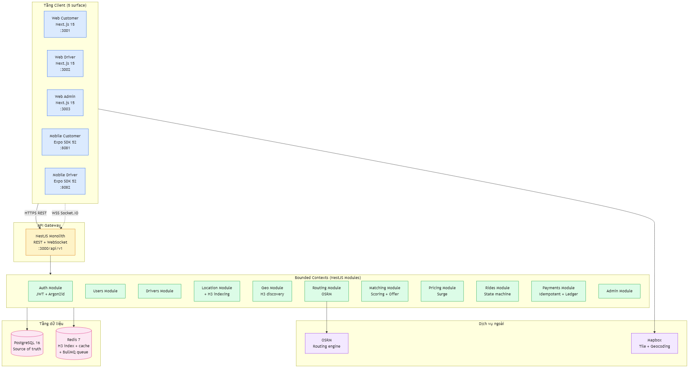
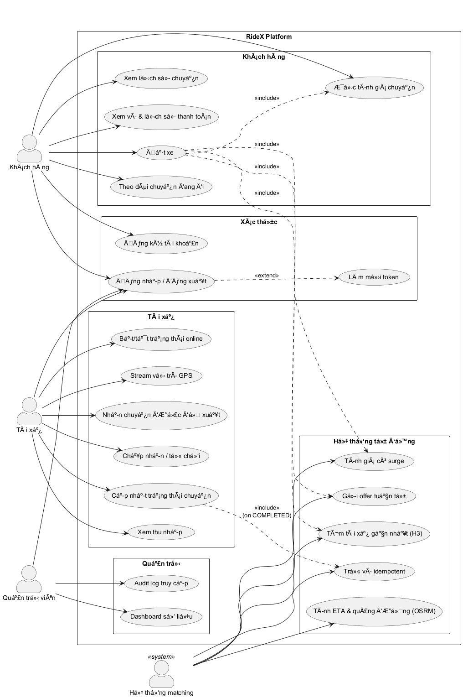
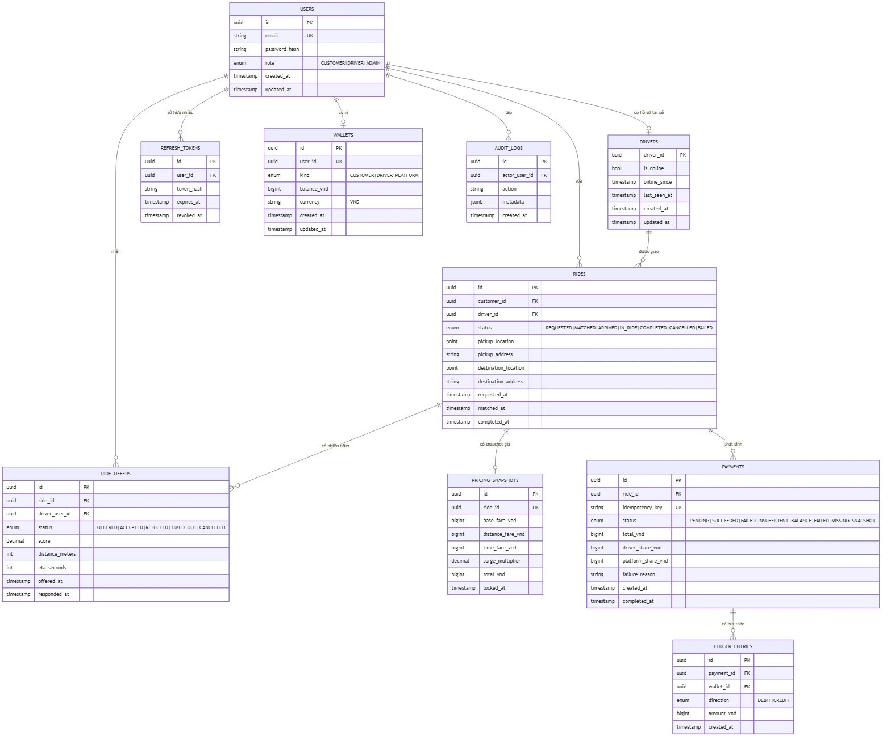
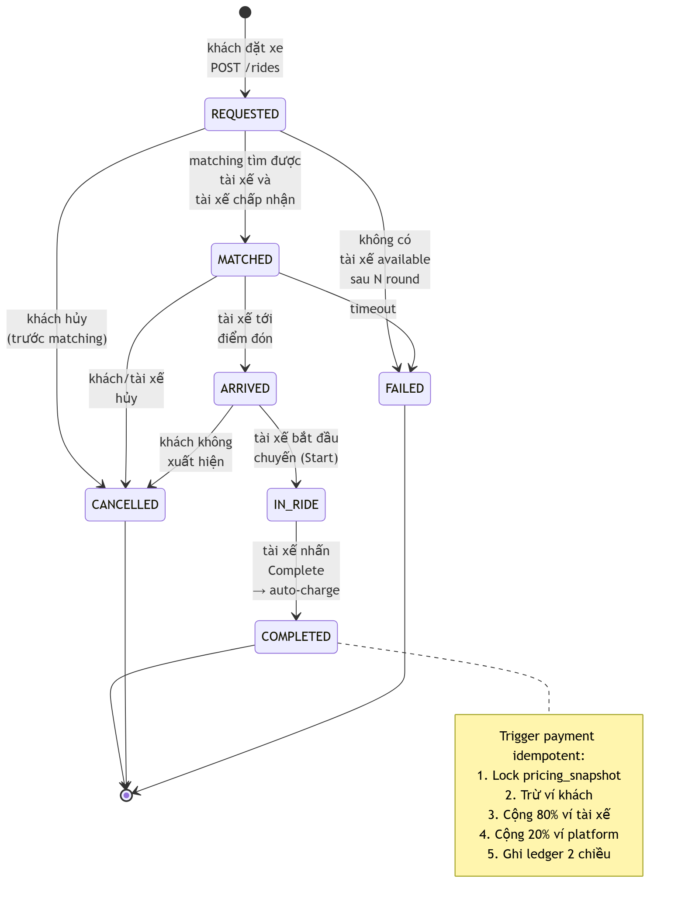
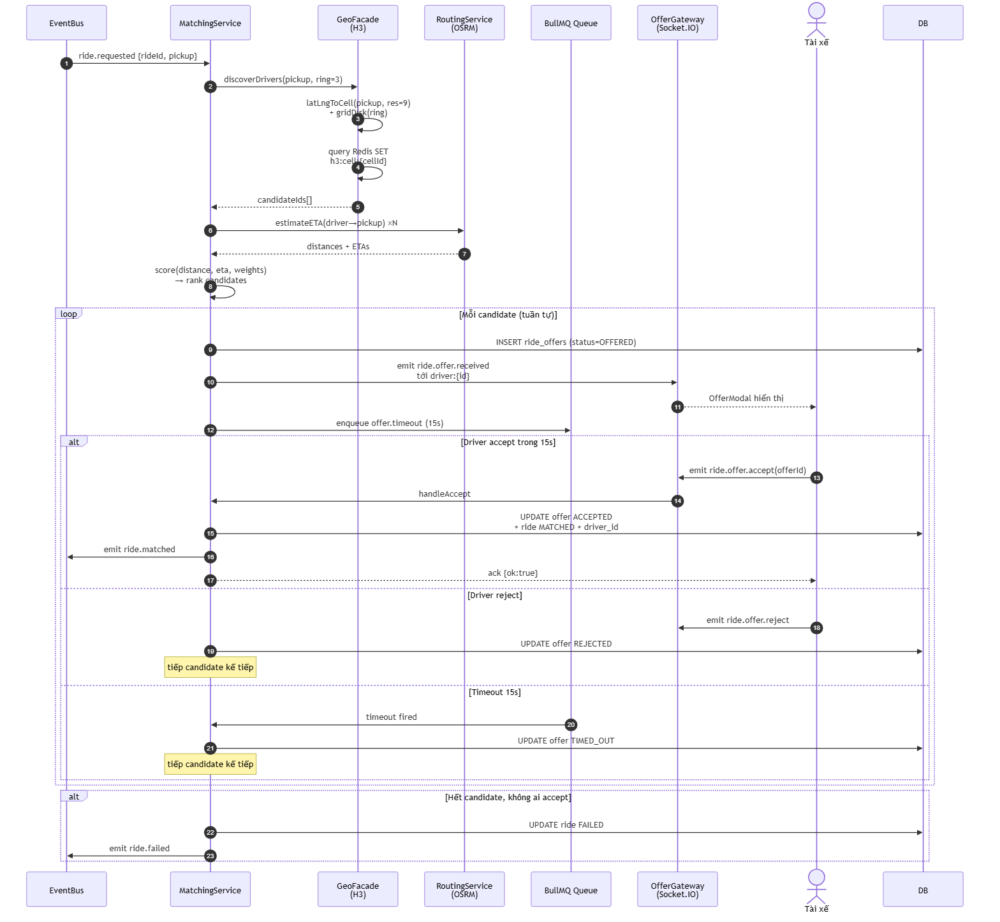
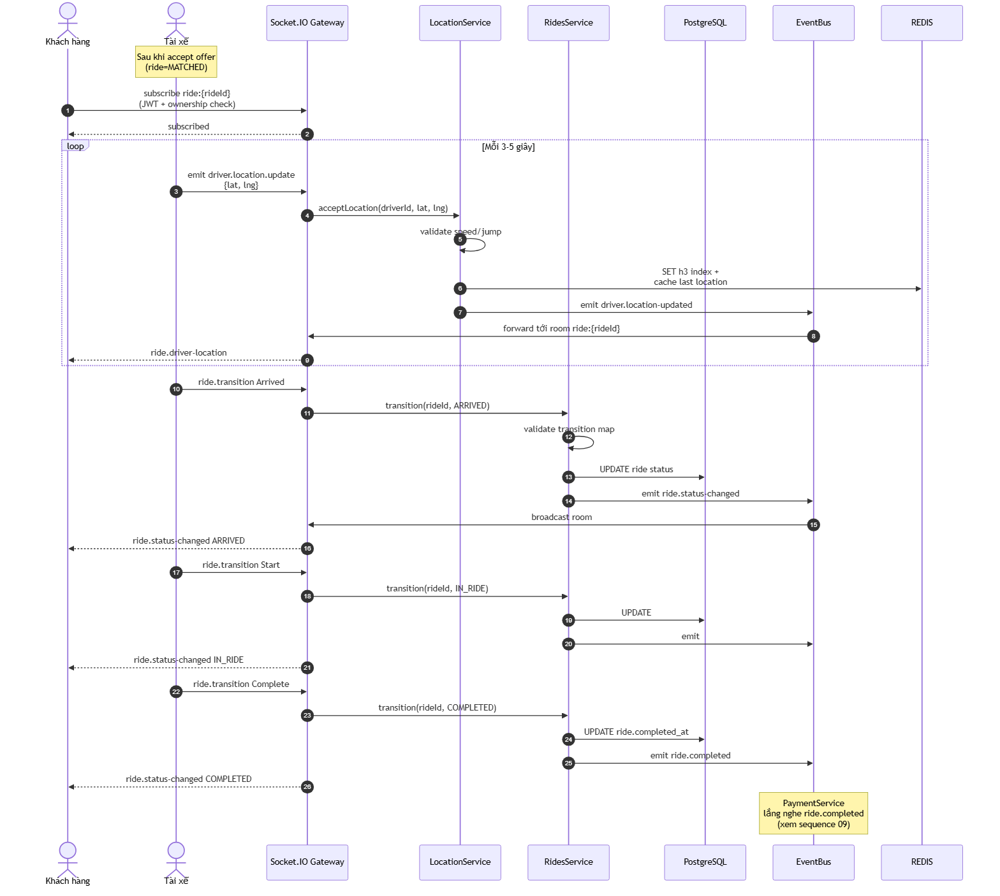
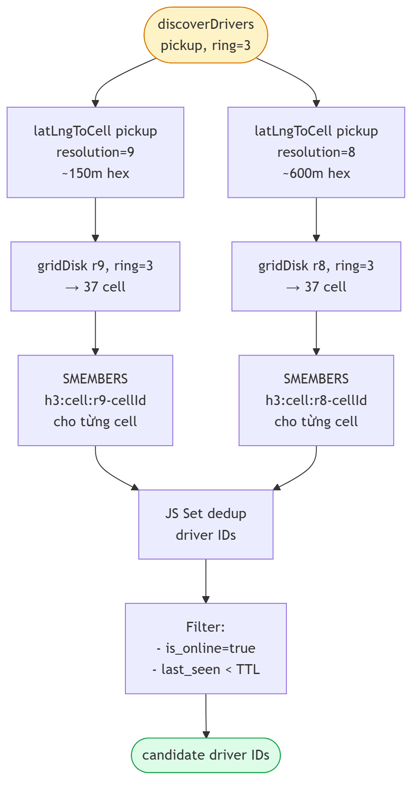
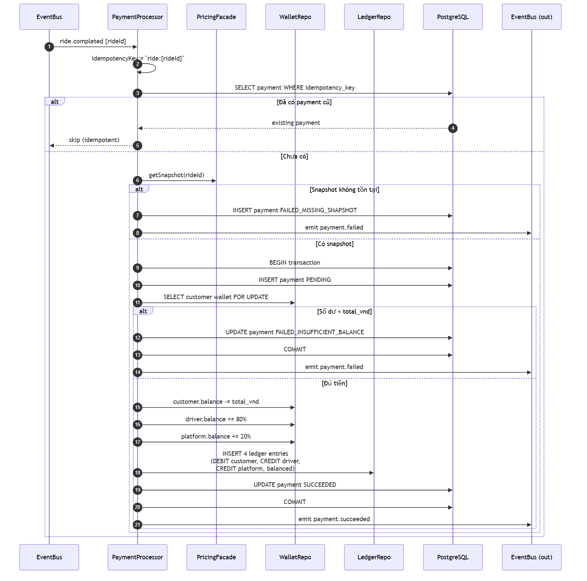

<!-- _class: lead -->
<!-- _paginate: false -->

# Nghiên cứu và xây dựng nền tảng đặt xe trực tuyến **RideX**
## Dựa trên kiến trúc microservice với NestJS

**Sinh viên thực hiện:** Lý Hải Quân — [MSSV]
**Giảng viên hướng dẫn:** [Học hàm, Học vị, Họ tên]
**Khoa:** [Tên Khoa] — Trường [Tên Trường]
**Năm học:** 2025–2026

---

## Mục tiêu khóa luận

**Bài toán:**
Thiết kế và hiện thực hoá một nền tảng ride-hailing (mini Grab/Uber) đủ độ phức tạp để rèn luyện kỹ năng thiết kế hệ thống cấp doanh nghiệp.

**Mục tiêu cụ thể:**

- Triển khai **vòng đời chuyến xe** đầy đủ: ước tính giá → đặt → matching → in-ride → thanh toán
- Áp dụng **DDD + Facade pattern** trên 11 bounded context
- Tích hợp công nghệ thực tế: **NestJS, H3, OSRM, BullMQ, Mapbox, Expo**
- Đảm bảo chất lượng: **test coverage cao, TypeScript chặt chẽ, code review chu trình**

---

## Phạm vi đề tài

**✅ Có trong phạm vi**

- Auth JWT + Argon2id + RBAC
- Vòng đời ride đầy đủ (REQUESTED → COMPLETED)
- Matching engine H3 + OSRM + scoring
- Pricing surge dựa trên cung-cầu
- Payment idempotent + double-entry ledger
- **5 bề mặt client**: 3 web + 2 mobile
- Admin dashboard có audit log
- Maestro E2E race coverage

**❌ Ngoài phạm vi**

- Cổng thanh toán thật (VNPay/Momo)
- KYC OCR
- ML matching/pricing
- Triển khai cloud production

---

## Kiến trúc tổng thể



**3 tầng:** Client (5 surface) → API Gateway (NestJS) → Module nghiệp vụ (11) → Data (Postgres + Redis)

---

## Tech Stack

| Tầng | Công nghệ |
|---|---|
| **Backend** | NestJS 10 · TypeORM · PostgreSQL 16 · Redis 7 |
| **Realtime** | Socket.IO · BullMQ |
| **Spatial** | Uber H3 (h3-js v4) · OSRM |
| **Auth** | JWT (RS256) + Argon2id |
| **Web** | Next.js 15 (App Router) · shadcn/ui · Tailwind |
| **Mobile** | Expo SDK 52 · NativeWind · expo-router |
| **State** | TanStack Query v5 |
| **Map** | Mapbox GL JS · @rnmapbox/maps |
| **Test** | Jest · Maestro |
| **DevX** | pnpm + Turborepo · Docker Compose |

---

## Use Case tổng thể



**4 actor:** Khách hàng · Tài xế · Quản trị viên · Hệ thống tự động (matching, pricing, auto-charge)

---

## Mô hình dữ liệu (ERD rút gọn)



**10 bảng** chính · sử dụng PostgreSQL enum, partial unique index, FOR UPDATE lock cho payment

---

## Máy trạng thái Ride



**7 trạng thái** · bảng chuyển dịch hợp lệ được validate ở backend (defense-in-depth)

---

## Luồng đặt xe + Matching



**Gửi offer tuần tự** với BullMQ timeout 15s · không broadcast để tránh race tay không

---

## In-ride realtime



**Socket.IO room** `ride:{rideId}` · driver stream vị trí 3-5s · backend validate speed/jump

---

## Bảo mật

**JWT rotation**
- Access token TTL 15p, refresh TTL 7d
- Mỗi refresh rotate, chống replay
- Token hash SHA-256 trong DB

**Argon2id**
- Tham số OWASP 2024: memory 19MB, time 2, parallelism 1
- Kháng GPU/ASIC tốt hơn bcrypt

**RBAC + IDOR defense**
- 3 role: CUSTOMER · DRIVER · ADMIN
- Object-level ownership check trên mọi endpoint

**WebSocket auth**
- JWT trong handshake auth payload
- Room permission check mỗi event

---

## Matching engine



**3 bước:**
1. **H3 discovery** — quét 2 resolution (r8 + r9), bán kính 3 cell
2. **OSRM ETA** — gọi parallel cho top candidates
3. **Score & rank** — `0.6 × distance + 0.4 × ETA`, gửi tuần tự

Atomic Lua EVAL cho cập nhật chỉ mục → loại bỏ TOCTOU

---

## Pricing Surge

```
surge = 1 + (demand/supply - threshold) × coefficient
clamp: [1.0, SURGE_CAP=3.0]
```

- **Demand:** Redis ZSET `pricing:demand:{cellId}` đếm request trong window 5 phút
- **Supply:** Số driver online trong cell (reuse H3 index)
- **Lock at request:** `pricing_snapshots` khoá giá tại thời điểm đặt
- **Env validation:** mọi tham số check ở boot — fail fast

---

## Payment Idempotency 3-layer



1. **Layer 1 (App):** check `idempotency_key` tồn tại
2. **Layer 2 (DB):** `UNIQUE INDEX` trên column
3. **Layer 3 (Row):** transaction + `SELECT ... FOR UPDATE` trên ví

**Double-entry ledger:** 1 DEBIT customer + 1 CREDIT driver (80%) + 1 CREDIT platform (20%) — sum = 0

---

## Frontend monorepo

```
ridex/
├── apps/{backend, web-customer, web-driver, web-admin,
│         mobile-customer, mobile-driver}
└── packages/{api-client, socket-client, shared-types,
              ui-tokens, ui-web, ui-mobile, config-*}
```

**Tái sử dụng tối đa:** types DTO share giữa BE↔FE; OpenAPI-typed REST client; Socket.IO event constants share giữa client↔server

**Auth lưu trữ:** httpOnly cookie (web) · expo-secure-store (mobile)
**Refresh rotation:** singleton promise tránh gọi parallel

---

## Test & chất lượng

| Module | # test |
|---|---|
| auth · users · drivers | 74 |
| location · geo · routing | 95 |
| matching | 67 |
| pricing | 34 |
| rides | 53 |
| **payments** | **71** |
| admin · common · DTO · gateway | 89 |
| **Tổng backend** | **483** ✅ |

- Backend lint: **0 error**
- Web 3 surface build production: **clean**, shared bundle ~102 KB
- Mobile 2 surface typecheck: **clean**
- Maestro E2E: 2 flow cover offer-leak + complete-ride-redirect race

---

## Demo — Khách hàng đặt xe

*(Screenshot: home, chọn điểm đón/đến, hiển thị giá ước tính, "Đang tìm tài xế", màn hình theo dõi tài xế realtime)*

---

## Demo — Tài xế nhận chuyến

*(Screenshot: GO online, modal Offer, in-ride 3 nút Arrived/Start/Complete, hoàn tất có thu nhập)*

---

## Demo — Admin dashboard

*(Screenshot: số liệu ride theo trạng thái, số driver online, doanh thu ngày, audit log)*

---

## Kết quả đạt được

- ✅ **5 bề mặt người dùng** chạy được full flow
- ✅ **483 backend test** xanh, lint clean, build clean
- ✅ **22 task** đã đặc tả + review + merge
- ✅ **~48k dòng mã** TypeScript chặt chẽ end-to-end
- ✅ **12 sơ đồ** kiến trúc + thiết kế đầy đủ
- ✅ **Mã nguồn mở** + tài liệu tiếng Việt chi tiết

---

## Hạn chế & Hướng phát triển

**Hạn chế**
- Ví nội bộ thay vì VNPay/Momo thật
- KYC tài xế bỏ trống
- Surge tuyến tính, chưa có ML
- Triển khai chỉ docker-compose cục bộ

**Hướng phát triển ngắn hạn**
- Tích hợp cổng thanh toán thật
- KYC OCR + admin verify queue
- Maestro CI với self-hosted Linux runner

**Hướng phát triển trung hạn**
- Tách microservice từng phần (matching, payments)
- Event sourcing cho payments
- ML cho surge và matching

---

<!-- _class: lead -->

# Xin chân thành cảm ơn quý Thầy/Cô và hội đồng

**Q & A**

📂 Mã nguồn: `github.com/<user>/ridex`
📧 lyhaiquan020705@gmail.com

